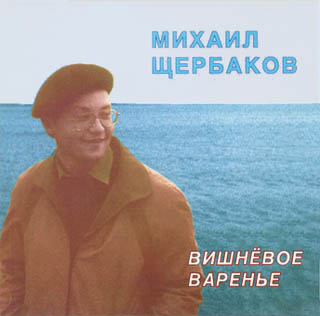

= Вишневое варенье
Михаил Щербаков
1994
:toc:

From::
http://blackalpinist.com/scherbakov/Disks/ +
https://mkshch.com/

== Восходя дорогой горной

[verse,1986]
____
Восходя дорогой горной прямо к бездне голубой,
не печалься, брат мой гордый, будет нам ещё с тобой -
и парча ковров ценнейших, и невиданный фарфор,
и красавиц августейших неожиданный фавор.

Не раздавят нас, ей-Богу, ни чужбина, ни нужда.
Будет нам всего помногу. А не будет - не беда.

И когда недуг сердечный вдруг сожмёт тебя в горсти,
не печалься, друг мой вечный, твой корабль уже в пути.
Не зазря ломал ты крылья, не напрасно ты страдал,
и бесился от бессилья, и от холода рыдал.

Потеряешь счёт пожиткам, предсказаньям вопреки.
Будет нам всего с избытком. А не будет - пустяки.

И покуда шёпот струнный всё зовёт куда-то вдаль,
дольше срока, принц мой юный, не продлится твой февраль.
Вспыхнет утро, грянут грозы, льды сойдут, снега сойдут,
и твои ночные слёзы дневным садом прорастут.

Будь что будет, знай, не медли, путь не близок, в добрый час!..
Там посмотрим - будет, нет ли... Не печалься, будет с нас.
____

== Романс

[verse,1985]
____
Давным-давно, мой бедный брат, оставил ты дела.
Слепой недуг душой твоей владеет безраздельно.
С тех пор, как чей-то чудный взор смутил тебя смертельно -
кумира славят день и ночь твои колокола.
Ужель напрасен ход времён, и нынче, словно встарь,
стремленья наши так темны, кумиры так жестоки?
Зачем, скажи, ты в этот храм принёс свои восторги?
Зачем так скоро жизнь свою ты бросил на алтарь?

Ужель затем, чтобы, когда она уйдёт совсем,
Однажды вдруг поведать мне печально и мятежно
о том, что ты любил её так искренно, так нежно,
как более не дай ей Бог любимой быть никем?
Я знал тебя в тяжёлый час и в битве, и в игре.
Ты утешений не просил и головы не вешал.
Но сей недуг страшней других, и я б тебя утешил,
когда б не тлела жизнь моя на том же алтаре.

Давным-давно, мой бедный брат, мне твой недуг знаком.
И он знаком не только мне, сжигает он полмира.
И славит гибельный огонь владычество кумира.
Но сами мы его зажгли в язычестве своём.
И что поделать, если уж горит огонь, горит,
и всё никак не стихнет дрожь от давнего испуга,
и скрип колёс, и шум кулис, и тёплый ветер с юга
одно и то же вновь и вновь мне имя говорит...
____

== Ad Leuconoen

[verse,1987]
____
Не кричи, глашатай, не труби сбора.
Погоди, недолго терпеть.
Нет, ещё не завтра, но уже скоро -
Риму предстоит умереть.
Радуйся, торговец, закупай мыло,
мыло скоро будет в цене.
Скоро всё иначе будет, чем было.
А меня убьют на войне.

Не зевай, историк, сочиняй книгу,
наблюдай вращенье Земли.
Каждому столетью, году, дню, мигу,
сколько надлежит, удели.
Ветер подымается, звезда меркнет,
цезарь спит и стонет во сне.
Скоро станет ясно, кто кого свергнет.
А меня убьют на войне.

Смейся, Левконоя, разливай вина,
знать, что будет, ты не вольна.
Можешь мне поверить, по всему видно,
что тебя не тронет война.
Знать, что будет завтра, - много ль в том толка!
Думай о сегодняшнем дне.
Я ж, хотя и знаю, но скажу только,
что меня убьют на войне.
____

== Вишневое варенье

[verse,1984]
____
Теперь на пристани толпа и гомонит, и рукоплещет:
из дальних стран пришёл корабль, его весь город ожидал.
Горит восторгом каждый лик, и каждый взор восторгом блещет.
Гремит салют, вздыхает трап, матросы сходят на причал.
Сиянье славы их слепит, их будоражит звон регалий,
у них давно уже готов ошеломляющий рассказ -
как не щадили живота, и свято честь оберегали,
и всё прошли, и превзошли, и осознали лучше нас.

Ты знаешь, я не утерплю, я побегу полюбоваться,
я ненадолго пропаду, я попаду на торжество.
Ну сколько можно день и ночь с тобою рядом оставаться
и любоваться день и ночь тобой - и больше ничего!
Ведь мы от моря в двух шагах, и шум толпы так ясно слышен.
Я различаю рокот вод, я внемлю пушечной пальбе.
А ты смеёшься надо мной, ты ешь варение из вишен
и мне не веришь ни на грош, и я не верю сам себе.

Вот так идёт за годом год, вокруг царит столпотворенье,
и век за веком растворён в водовороте суеты.
А ты ужасно занята, ты ешь вишнёвое варенье,
и на земле его никто не ест красивее, чем ты.
Изгиб божественной руки всегда один и вечно новый,
и в ложке ягодка блестит, не донесённая до рта...
Не кровь, не слёзы, не вино - всего лишь только сок вишнёвый.
Но не уйти мне от тебя и никуда, и никогда.
____

== Болеро

[verse,1985]
____
Не зря ли я взывал до хрипоты, племена миря?
Вражды не одолел, не смял границ, не сломал плотин.
Ведь если б даже люди всей Земли одного меня
избрали и вручили мне весь мир, то что б я смог - один?

А я был не один и всё равно ничего не смог,
и сроки на исходе, и вот-вот повлекут к суду.
Вот-вот уже появятся лучи, задрожит восток,
и вспомнится моё любое слово,
и спросится за каждое движенье,
и знаю я, что не смогу ответить,
и всё равно - иду.

И пусть, когда настанет расчёт,
Господь мне не простит, но зачтёт.

Но ты во имя царствия любви меня простишь
за то, что я столь близкий для себя начертал предел.
В то время как другие брали власть, ордена, престиж,
я слишком много думал о тебе - и ничего не успел.

И то, что я растратился вотще, племена миря,
стараюсь не вменять себе в вину, но иметь в виду.
Оно, быть может, правда, ни к чему, а всё равно - не зря.
Поскольку порождается надеждой
на призрачное радужное завтра,
до коего дойти не уповаю.
И всё равно - иду.

И пусть, когда настанет расчёт,
Господь мне не простит, но зачтёт.
____

== Душа

[verse,1985]
____
Оставлю всех, пройду повсюду,
пускай ни с чем, но не в долгу.
Себя раздам, тебя забуду,
мне всё равно, я всё могу.
А вот душа... она не может,
небесный свет в неё пролит,
неясный зов её тревожит,
она поёт, она болит.

И пусть вдали над цепью горной
уже взлетел, уже возник
мой монумент нерукотворный,
я сам себе его воздвиг.
А всё ж душа ему не рада,
не укротить её никак.
Она парит, и ей не надо
ни гор златых, ни вечных благ.

Когда ж беда сомкнёт объятья,
ничем я ей не возражу.
Родимый край пришлёт проклятья,
в чужих краях ответ сложу.
И лишь душа неколебима,
в грязи чиста, в беде честна.
Всё так же ей горька чужбина
и сладок дым Отечества.
____

== Маленькая хозяйка

[verse,1984]
____
Никто из нас не знал надёжнее лазейки
из царства холодов в республику тепла:
Мы собирались все у маленькой хозяйки,
она была всегда мила и весела.

И в долгий летний день, и в зимний день короткий -
неведомо за что съедали нас дела;
но вечером мы все у маленькой красотки
сходились, и она всегда была мила.

Сходились голоса, сплетались интересы,
не портила бесед ни ссора, ни вражда.
И все мы вновь и вновь у маленькой принцессы
встречались, и она... она была всегда.

Её любили все - чем дальше, тем сильнее.
Никто не знал, когда всё это началось:
чем лучше было нам, когда мы были с нею,
тем хуже было нам, когда мы были врозь.

И приближался крах весёлой нашей шайки,
поскольку где любовь - там ревность и раздор.
До некоторых пор у маленькой хозяйки
не видывали ссор, но с некоторых пор -

мы, перья распустив, вытягивали шеи,
сверкая в полутьме огнём ревнивых глаз.
Чем дальше, тем острей, чем дольше, тем сильнее
претензии росли у каждого из нас.

И так за часом час - никак не разберёмся,
и каждый наконец решил себе тогда,
что надо уходить, не то передерёмся,
и вот мы разошлись - обратно в холода.

А милый наш кумир, прелестная игрушка,
стояла у окна, глядела нам вослед.
Она любила всех, ей было очень грустно,
не менее, чем нам. Но, может быть, и нет...
____

== Прощальная 1

[verse,1984]
____
Вы нам простите, если что,
мы ж, если что, простим вам тоже.
Какие могут быть упрёки,
коль так ничтожна их цена!
Мы пожелали вам добра,
вы пожелали нам того же,
и мы шагаем по дороге,
и не кончается она.
        Хозяйка вашего стола,
        прощаясь, так на нас смотрела!
        Но прервала на полуслове
        она признание своё.
        Мы не увидимся вовек,
        и что сказать она хотела -
        для нас останется загадкой.
        А может быть - и для неё.
А завтра будет новый день,
к вам новый путник постучится,
и будут новые заботы
сменять былые каждый час.
Мы не увидимся вовек,
и потускнеет, запылится
и затеряется бесследно
воспоминание о нас.
        Утихнет ветер, ляжет пыль,
        всё успокоится в итоге,
        но кто сказал, что мы несчастны -
        живём терзаясь и терпя?
        Напротив, нам-то хорошо,
        ведь мы шагаем по дороге,
        а там у вас всё так непрочно,
        поберегите же себя.
____

== Кибитка

[verse,1983]
____
Всё скрылось, отошло, и больше не начнётся.
Роман и есть роман. В нём всё как надлежит.
Кибитка вдаль бежит, пыль вьётся, сердце бьётся.
Дыхание твоё дрожит, дрожит, дрожит.
И проку нет врагам обшаривать дорогу,
им нас не отыскать средь тьмы и тишины.
Ведь мы теперь видны, должно быть, только Богу.
А может, и Ему - видны, да не нужны.

А где-то позади, за далью и за пылью
остался край чудес. Там человек решил,
что он рождён затем, чтоб сказку сделать былью.
Так человек решил. Да, видно, поспешил.
И сказку выбрал он с печальною развязкой,
и призрачное зло в реальность обратил.
Теперь бы эту быль обратно сделать сказкой,
да слишком много дел и слишком мало сил.

А мы всё мчимся вдаль, печаль превозмогая,
как будто ничего ещё не решено,
как будто век прожив и всё-таки не зная,
что истина, что нет, что свято, что грешно.
И бесконечен путь, и далека расплата.
Уходит прочь недуг, приходит забытьё.
И для меня теперь так истинно, так свято
чуть слышное в ночи дыхание твоё.
____

== Аллилуйя

[verse,1986]
____
Помнишь, как оно бывало? Всё горело, всё светилось,
утром солнце как вставало, так до ночи не садилось.
А когда оно садилось, ты звонила мне и пела:
«Приходи, мол, сделай милость, расскажи, что солнце село».
И бежал я, спотыкаясь, и хмелел от поцелуя,
и обратно брёл, шатаясь, напевая «аллилуйя».
Шёл к приятелю и другу, с корабля на бал и с бала
на корабль - и так по кругу, без конца и без начала.

На секунды рассыпаясь, как на искры фейерверка,
жизнь текла, переливаясь, как цыганская венгерка.
Круг за кругом, честь по чести, ни почётно, ни позорно...
Но в одном прекрасном месте оказался круг разорван.
И в лицо мне чёрный ветер загудел, нещадно дуя.
А я даже не ответил, напевая «аллилуйя».
Сквозь немыслимую вьюгу, через жуткую позёмку
я летел себе по кругу и не знал, что он разомкнут.

Лишь у самого разрыва я неладное заметил
и воскликнул: «Что за диво!» Но движенья не замедлил.
Я недоброе почуял, и - бессмысленно, но грозно -
прошептал я «аллилуйя», да уж это было поздно.
Те всемирные теченья, те всесильные потоки,
что диктуют направленья и указывают сроки,
управляя каждым шагом, повели меня, погнали
фантастическим зигзагом по неведомой спирали.

И до нынешнего часа, до последнего предела
я на круг не возвращался. Но я помню, как ты пела.
И уж если возвращенье совершить судьба заставит,
пусть меня моё мгновенье у дверей твоих застанет.
Неприкаянный и лишний, окажусь я у истока.
И пускай тогда Всевышний приберёт меня до срока.
А покуда ветер встречный всё безумствует, лютуя, -
аллилуйя, свет мой млечный! Аллилуйя, аллилуйя...
____

== Кони в вагоне

[verse,1985]
____
И в штилях, и в штормах, и в тризнах, и в войнах
всё видится мне то ли явь, то ли сон:
как будто загнали коней моих вольных
сначала в загон, а затем и в вагон.
И медленно, с лязгом, под крики конвойных
тяжёлый состав начинает разгон.

Крылатые кони под грохот состава
сложили прекрасные крылья свои.
Уснувшая стая вздыхает устало,
под грохот состава летя в забытьи.
Пленённые птицы, летучее стадо,
крылатый табун - это годы мои.

Какие их прежде ласкали ладони!
А нынче засады в пути сторожат.
Не дремлют стрелки, только вольные кони
не слышат, не видят, не ведают - спят.
Влачатся, влекутся в летящем вагоне,
и снится им, что они сами летят.

И кажется им, что не будет ни крови,
ни грома, ни дыма, ни новой войны.
Ах, вольные кони из дальней любови!
Ах, быстрые птицы из давней весны!
Скачите, скачите... стрелки наготове.
Летите, летите... курки взведены...
____

== Трубач

[verse,1986]
____
- Ах, ну почему наши дела так унылы?
Как вольно дышать мы бы с тобою могли!
Но - где-то опять некие грозные силы
бьют по небесам из артиллерий Земли.

- Да, может, и так, но торопиться не надо.
Что ни говори, неба не ранишь мечом.
Как ни голосит, как ни ревёт канонада,
тут - сколько ни бей, всё небесам нипочём.

- Ах, я бы не клял этот удел окаянный,
но - ты посмотри, как выезжает на плац
он, наш командир, наш генерал безымянный,
ах, этот палач, этот подлец и паяц!

- Брось! Он ни хулы, ни похвалы не достоин.
Да, он на коне, только не стоит спешить.
Он не Бонапарт, он даже вовсе не воин,
он - лишь человек, что же он волен решить?

- Но - вот и опять слёз наших ветер не вытер.
Мы побеждены, мой одинокий трубач!
Ты ж невозмутим, ты горделив, как Юпитер.
Что тешит тебя в этом дыму неудач?

- Я здесь никакой неудачи не вижу.
Будь хоть трубачом, хоть Бонапартом зовись.
Я ни от кого, ни от чего не завишу.
Встань, делай как я, ни от чего не завись!
И, что бы ни плёл, куда бы ни вёл воевода,
жди, сколько воды, сколько беды утечёт.
Знай, всё победят только лишь честь и свобода,
да, только они, всё остальное - не в счёт...
____

== Мария

[verse,1984]
____
Столько разных людей утешала ты.
Не смолкают людей голоса.
О, Мария! Смешны мои жалобы.
Но прекрасны твои небеса.

Не умею добраться до истины,
не умею творить чудеса.
О, Мария! В огне мои пристани,
но безбрежны твои небеса.

Наступает предел всем пристрастиям,
нет ни друга, ни верного пса.
О, Мария! Конец моим странствиям
объявляют твои небеса.

Были поросли бед, стали заросли.
Завещание я написал.
О, Мария! Грустны мои замыслы,
но грустны и твои небеса.
____

== Ковчег неутомимый

[verse,1988]
____
Надежды прочь, сомнения долой,
забыты и досада, и бравада.
Граница между небом и водой
уже неразличима, и не надо.
По-прежнему свободный свой разбег
сверяя с параллелью голубою,
плывёт неутомимый наш ковчег,
волнуемый лишь смертью и любовью.

Проблемы вечной - бысть или не бысть -
решенья мы не знаем и не скажем,
зато ни жажда славы, ни корысть
уже не овладеют экипажем.
И если мы несёмся через льды,
не чувствуя ни холода, ни боли,
то это всё ни для какой нужды,
а только ради смерти и любови.

Воистину ничем не дорожа
за этим легкомысленным занятьем,
мы верим, что не будет платежа,
но если он и будет, мы заплатим.
Чего бояться нам - тюрьмы, тоски,
ущерба очагу, вреда здоровью?..
Но это всё такие пустяки
в сравнении со смертью и любовью.
____

== Прощальная 2

[verse,1985]
____
Вчера и сегодня, и завтра, и после, почти незаметно,
всегда неизменно, почти не начавшись, кончаются сроки.
Суда уплывают, почти не дождавшись попутного ветра.
В далёкие дали они уплывают, почти не разведав счастливой дороги.
Они исчезают, становятся сказкой, становятся пылью.
Но долгое время мне видятся в дымке их белые крылья.

Вчера и сегодня, и завтра, и после, покуда живётся,
до синего неба, до самого края, до цели заветной,
всегда неизменно, куда - неизвестно, покуда плывётся, -
плывите, плывите, а я вам желаю счастливой дороги, попутного ветра!
И пусть вас почаще обходят ненастья, и бури жалеют,
и пусть ваши крылья всё выше взлетают, всё ярче белеют.

Мы свиделись с вами в гостях у какого-то странного века.
И нынче меж нами - обряды, обеты, законы, запреты.
Мы были чужими, мы стали друзьями... Попутного ветра!
И пусть вас минуют жестокие штормы, подводные камни и прочие беды!
Плывите, плывите, и пусть ничего не осталось в залоге.
Мы были друзьями, мы стали чужими... Счастливой дороги!

И пусть разделяет нас время, и даже - различная вера.
Но где-то в тумане, в той дымке, где с небом сливается море,
быть может, однажды, внезапно дождавшись попутного ветра,
по странным законам, по вечным законам, мы встретимся снова, мы свидимся вскоре...
Мы встретимся с вами, мы были чужими, мы были друзьями...
                                        Счастливой дороги!
Плывите-плывите, мы станем другими, мы встретимся с вами...
                                         Попутного ветра!..
____

== Юбилейная

[verse,1985]
____
А нас ещё осудят, а мы ещё ответим,
а нас ещё потреплют, а мы ряды сомкнём.
А нынче годовщина, и мы её отметим.
Не правда ли, как странно, как долго мы живём?
Мы так надёжно помним мотив, нам данный Богом,
мы так легки в движеньях - взлетим, того гляди.
Мы так неспешно ходим по нынешним дорогам,
как будто не мгновенье, но вечность впереди.

Какие наши годы - такие наши песни.
А всё, что с нами было, забудется легко.
А всё, что с нами будет, начертано на перстне,
а перстень брошен в море, а море велико.
А море необъятно, над морем небо звёздно,
за морем дальний берег, над берегом покой.
И море дремлет чутко, и море дышит грозно,
и шум его дыханья нам слышится порой.

Мужайтесь же, о братья, исполнившись усердья,
творите что хотите, покуда хватит дня.
А длительного счастья, покоя и бессмертья
я дал бы вам с лихвою, да нету у меня.
Ещё не раз эпоха то радостью, то болью
наполнит наши струны и наши голоса.
И будем мы друг друга дарить своей любовью,
пока своей любовью нас дарят небеса.
____

== Балаган

[verse,1986-1987]
____
В одних садах цветёт миндаль, в других метёт метель.
В одних краях ещё февраль, в других - уже апрель.
Проходит время, вечный счёт: год за год, век за век...
Во всём - его неспешный ход, его кромешный бег.
В году на радость и печаль по двадцать пять недель.
Мне двадцать пять недель февраль, и двадцать пять - апрель.
По двадцать пять недель в туман уходит счёт векам.
Летит мой звонкий балаган куда-то к облакам.

Летит и в холод, и в жару, и в гром, и в тишину.
А я не знаю, как живу, не знаю, чем живу.
Не понимаю, как творю, не знаю, что творю.
Я только знаю, что горю и, видимо, сгорю...
В одних краях - рассветный хлад, в других - закатный чад.
В одних домах ещё не спят, в других - уже не спят.
То здесь, то там гремит рояль, гудит виолончель...
И двадцать пять недель февраль, и двадцать пять - апрель.

Вели мне, Боже, всё стерпеть, но сердцу - не вели.
Оно хранит уже теперь все горести Земли.
И разорваться может враз, и разлететься врозь.
Оно уже теперь, сейчас - почти разорвалось.
Мой долгий путь, мой дальний дом, великая река -
моя дорога!.. И кругом - одни лишь облака.
Такая мгла, такая даль, такая карусель...
И двадцать пять недель февраль, и двадцать пять - апрель.

И сквозь томительный дурман по зыбким берегам
летит мой звонкий балаган куда-то к облакам...
____
