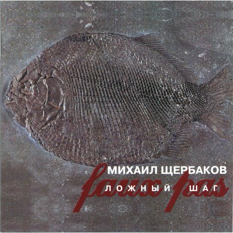

= Faux pas
Михаил Щербаков
1999
:toc:

From::
http://blackalpinist.com/scherbakov/Disks/ +
https://mkshch.com/

== Чужая музыка 1

[verse,1997]
____
Кроме тебя, Дункан, ещё и Макбет потерпел, учтём.
Ты королём смотрел, а был лишь одним из ключей к задаче.
Если б не ты, неужто сойтись иначе
звёзды убийц могли? Отвечаю «нет», ничком
лёжа в пустой мансарде вне сна и яви,
мудрствуя с кем попало о чём захочу.

В прошлом укладчик шпал, а ныне министр вообще путей,
не осчастливил ты меня, но, заметим, и не обидел.
Если б не ты, каких бы я стран не видел?
Чьих в каталог не внёс бы затей, страстей... детей,
пьющих второй нектар безрадостно - либо
хлеб второпях и сыр ломающих, чтобы не умереть.

Нет, факультет цитат, тебя ни ценить не рвусь, ни винить.
Свежесть в тебе была, но был ведь и приторный тон десертный.
Если б не ты, чего бы не знал я, смертный?
Разве гнушался бы заметать следы, темнить,
фору бы брать робел (когда не до шахмат),
путать не смел бы всякий акцент с любым...

О, неизвестно кто, умеющий жить неизвестно где.
Недруг я вряд ли твой. Добавим, и брат не тебе, тем паче.
Если б не я, ужель бы ты стал богаче?
Нешто с другим бы компасом шёл теперь к воде -
веки сухие мыть в реке грозовой, янтарной,
с промельком капель ясных как белый день.

Или полдень.
____

== Циркач

[verse,1997]
____
Сном называй, ворожбой, искушеньем,
но - чуть разглядев этот праздник чумной -
я возомнил, будто он соглашеньем,
пускай краткосрочным, но связан со мной.

Без году неделя в цирке, меньше, чем тот ворон на Майорке,
будь я - ну хотя бы не птенец, тогда оно бы - туда-сюда.
Мне же словно кто-то подмигнул - и вот, один во всей галёрке,
обмер я и воздух обнял, не исчезнуть чтобы. Что да то да.

Кровь осеклась, бормоча «поздно, поздно».
Душа заметалась, сама не своя.
Словно у всех на глазах виртуозно
не рыжий ковёрный споткнулся, а я.

Словно в заводной шкатулке вентиль или клапан, там не важно,
сбился, ноту взял и отпустить не мог, о чудо, аж полчаса.
Всякий звук умолк, а этот нет, и - вполрезьбы, но так протяжно -
длился, не кончался, не кончался он, покуда не кончился.

Семь с той поры январей незаметных
в архив отошло и быльём поросло.
Помню ещё, что крикун в позументах
картавил, но это меня не спасло.

Я и не расслышал толком, что он объявлял, вертя фасадом.
Видно, речь его и впрямь была скорей корява, чем вычурна.
Понял я лишь то, что неширок под ним помост и рядом-рядом -
бездна. Глубже впадины морской. Черней зуава. Черным-черна.

Врач говорит: магистраль не задета.
Испуг излечим. А могло б и убить.
Цирк отступил. Расцвела оперетта.
Любить ли её? Слух прошёл, что любить.

Впрочем, тут и «да» и «нет» верны, пиши рецепт, какой охота.
Легче не бывало, не бывало, не бывало экзамена.
Кто-то и тебя потом с шарманкою сравнит, в которой что-то
долго замирало, замирало, замирало... И замерло.
____

== Ложный шаг

[verse,1998]
____
На причале ни души. Чаплин Чарли, не смеши.
Не до шуток, сдай назад. Время суток - закат.

Морщусь вяло, пряник ем. Всё пропало насовсем.
Люди, где ж вы? Мёртвый штиль. Все надежды - в утиль.

Я раздавлен. Я зеро. Мир поставлен на ребро.
Горек пряник. Штиль тяжёл. Мой «Титаник» ушёл.

Три куплета за плечом. Гарбо Грета ни при чём.
Вот ведь тоже - ложный шаг. Люди, что же вы так?

Обещали ждать гурьбой на причале, где прибой.
Люкс каюта, курс - Нью-Йорк. Стильно, круто, восторг.

Вслух я с ходу, как всегда, врал, что сроду никуда
плыть не чаял. Но в душе - таял, таял уже.

Думал, в среду, чуть заря, впрямь поеду за моря.
Метил, шляпа, в ловкачи.  Ну так - на, получи.

Аллен Вуди прав сто раз. Эти люди не за нас.
Им что сухо, что мокро. С ними ухо востро.

Род бесславный, сброд горилл. Им кто главный, тот и мил.
Дуй, мол, в трубы. Грабь да пей. Только в зубы не бей.

Отчим краем небрегут. Волю дай им, всё пожгут.
Главным коли стану сам, я им воли не дам.

...Меж тем где-то мчит оно - чудо света из кино.
Запах йода, зыбь да соль. Время года - ноль-ноль.

Эй, механик, полный ход. Мнёт «Титаник» волны вод.
Деньги, слава - не вопрос. Браво, браво, колосс!

Стих размеру подчинён. Фильм - Люмьеру. Вихрю - клён.
А «Титаник» - никому. Эй, механик, ау.
____

== Hочной дозор

[verse,1998]
____
На бок бы теперь и наповал. Но нет. Никак нельзя.
Рокот в перепонках начеку: не сметь, не спать, моргать.
Отдых - привилегия глухих. А ты не спи.
Ты слушай длинные гудки. Покуда кратких не черёд.

Томная соседка по купе. Но нет. Никак нельзя.
Тысяча резонов не велят. Согнись, уткнись в окно.
Важное в потёмках что-нибудь увидишь там.
Хотя скорее проглядишь. Да вот уже и проглядел.

Отдых - привилегия слепых. Не спи, моргай, танцуй.
Ноги-руки, думаешь, зачем? Затем. Нам лучше знать.
В чём и правда, если не в ногах? Не в крыльях же.
А мелкой меди, так и быть, возьми. Но больше не воруй.

Яблок бы сюда и коньяку. Но нет. Пардон, гарсон.
Каждому понятно, что нельзя. Моргай, считай гудки.
Либо и подавно не заснёшь. Не разрешат.
Ни этой шаткой тишины. Ни той, иной, иной, иной...

Важное в потёмках что-нибудь. Фантом какой ни есть.
Хочешь игнорировать его? Не сметь. Молчать. Моргать.
Сказано же русским языком: никак нельзя.
Уж тут не то что Боже мой. А просто мамочки мои.

Конница, того гляди, мелькнёт. Спроси: а сколько вас?
Чайки налетят - не оплошай. Сочти, сочти число.
Станут обращаться во слонов. И тех сочти.
Их легче лёгкого считать.  Они летают не ахти.

        Был бы пальмой. Рос бы стройно.
        Жил бы долго. Спал бы крепко.

Трудности у сотого слона: болит плечо.
Ещё немного, милый зверь, и можешь дальше не лететь.

Есть ещё лекарство, говорят. Глотнул - и как нырнул.
Сразу в перепонках никого. Гудков - ничьих нигде.
Что-то лишь такое о любви. Едва-едва.
Об этой - около, в слезах. И той, иной, иной, иной...
____

== Красные ворота

[verse,1997]
____
То галопом, то вверх тормашками - дни мелькают а ля драже.
Например, эти две с ромашками не полюбят меня уже.
Прежде взвыл о таком бы бедствии, нынче ж только губу скривлю:
ничего, как-нибудь впоследствии я их тоже не полюблю.

Не мычи, пассажир, так ласково. Стоит повесть твоя пятак.
Сколько пива в тебе голландского, я вполне угадал и так.
Худший способ вербовки ближнего - биография с молотка.
Эко диво, что ты из Нижнего! Хоть из Вышнего Волочка.

Ты бы шансы вперёд просчитывал, а внедрялся бы уж затем.
Или тот, кто тебя воспитывал, завоспитывался совсем?
Возражай естеству по-разному, раздражай ретивое, но
не указывай мне, алмазному, на своё золотое дно.

Темнота за стеклом - нормальная. То не юность мосты сожгла.
То банальная радиальная просияла и отошла.
Но коснуться того сияния, вспять отмерив по полверсты,
не сумеем уже ни я-я-я, ни тем более ты-ты-ты.

Подожди в турникет рекой впадать и дыши чуть в сторонку, да.
Мне от Красных ворот рукой подать, а тебе ещё вон куда.
Так что крепче держись за поручень. А когда побредёшь пешком,
лучше там припадай к забору, чем упадай в лопухи мешком.

Вот и якорь стальней стальнейшего. Ночь у Красных ворот свежа.
Светлячковый пунктир дальнейшего проникает в туман, жужжа.
Он теряется близ Рейкьявика. Дальше - джунгли долгот-широт.
В джунглях ни одного человека. Разумеется, я не в счёт.

Не буквально так синтаксически превратив «никогда» в «нигде»,
над кремнистым путём классически подпевает звезда звезде.
Я в торжественном их приветствии не нуждаюсь, но не горжусь:
ничего, как-нибудь впоследствии я им тоже не пригожусь.
____

== Рыба

[verse,1997]
____
Дожил. Изник в товаре. Язык на месте, а слов ничуть.
Рыба в стеклянном шаре меня смущает. Не что-нибудь.
Смотрит она сурово. Молчит неслышно. Блестит едва.
Рыба, шепни два слова. Хотя бы, что ли, «жива, жива».

Мелких, себе в убыток, набрал причастий. Вручил на чай.
Свился предлинный свиток в предолгий ящик. Прости-прощай.
Тщетно топчусь кругами, не возле даже, а вне всего.
Рыба, взмахни руками. Минор немыслим, спугни его.

Осень. Дожди. Дремота. Бездонный омут. Бессонный гнёт.
Бледный на фото кто-то вот-вот очнётся и подмигнёт:
помнишь кофейню в Сохо? Конечно помню. Да толку что!
Рыба, мне очень плохо. Мне даже хуже, чем только что.

«След мой волною смоет», - пропел ребёнок. И след пропал.
В гости? Сейчас не стоит. Явлюсь к разъезду. Скажу - проспал.
Или останусь дома, с ковра не двинусь. Не та луна.
Осень. Минор. Истома. Какие гости, когда волна?

«Всякой по паре твари», - прочёл я как-то. Незнамо где.
Рыба в стеклянном шаре - плохой помощник моей беде.
Гибкий предмет улова, деталь декора, форель-плотва.
Рыба, шепни два слова. Взмахни руками. Жива, жива.
____

== Два слова рыбы

[verse,1998]
____
Кошки черны в ночи и виденья схожи.
Может, с одним иных не сравнил бы сном.
Он позабыт отчасти уже, но всё же
я бы хотел два слова сказать о нём.

Виделись мне брега голубого Нила
или ещё какой-то большой реки.
Там над рекой светало. Волна ходила
взад и вперёд, и вздрагивали мостки.

Некто почти прозрачный спускался к лодке.
Веки прикрыв, на ощупь, на плеск, на звук
двигался он. И что-то в его походке
горло сжимало тем, кто молчал вокруг.

А проводить его собралось немало.
Все, кто могли, пришли, принесли дары.
Множество их толпилось вокруг, дышало.
И осушало кубки, и жгло костры.

Вина лились, вкуснее каких я не пил.
Некто к мосткам спускался, почти незрим.
И, высоко взметая огонь и пепел,
факельщик шёл, как плакальщик, вслед за ним.

Бубен гремел, но гром его был невесел.
Лодка ждала у берега на воде.
Профиль её и все восемнадцать вёсел
словно сказать пытались: идёт к беде.

Дева с цветком стояла в толпе, мигая,
не хороша, и даже не влюблена...
Много других там было, но не другая
мне почему-то помнится, а она.

В лодке гребцы, с обеих сторон по девять,
словно сказать пытались: беда не в нас,
мы не хотим, но что же теперь поделать?
И горизонт качался, и факел гас.

Вёсла скрипели. Было свежо и сыро.
Люди молчали. Бубен один гремел.
И силуэт всего остального мира
как бы уже значения не имел.

Слаб пересказ, не вышло пока иного.
Трудно догнать химеру, поспеть за сном.
Но всякий раз, коль скоро свяжу два слова,
снова скажу два слова о нём, о нём.
____

== Звездочет

[verse,1998]
____
Пернатым легче. Наук не знай.
Воркуй да каркай. Тешься натуральной снедью.
А я сижу пред звёздной картой.
читаю вслух энциклопедию и дрожу.

Какое множество диковин огненных роится в космосе! Страх.
Все вольно держится, мобильно движется, предельно вяжется в нём.
Земля уверенно лежит на трёх китах.
А мы с тобою кое-как, Бог весть на чём.

Цветёт торговля. Изюм в цене.
На верхней точке спрос на черемшу и сорго.
А я зачах на нервной почве,
не в силах думать без восторга о китах.

Какое мужество, какая грация, какие тысячи тонн!
Какое плавное существование, какой несуетный нрав!
Киты размеренно глотают свой планктон.
А мы растерянно глядим на сейсмограф.

В кино премьера. «Забриски пойнт».
Билетов нету. Денег на билеты тоже.
Пойти послать письмо в газету
о том, что Землю лучше всё же не спасать.

Она недаром ведь такая плоская, не зря похожа на диск.
Нарочно выдуман для населения неогороженный край.
Земля намеренно идёт на этот риск.
А мы никак того не ценим. Ай-ай-ай.

Шуршат потёмки. Коптит фонарь.
Летит аэробус, в тучах не весьма заметный.
Сижу, верчу небесный глобус,
листаю атлас межпланетный. И молчу.

А что тут вымолвишь, когда способен лишь на междометие «ах».
Ну, в крайнем случае, как исключение, на восклицание «ой».
Земля уверенно лежит на трёх китах.
А мы с тобою, мы с тобою, мы с тобой...
____

== От Рождества

[verse,1998]
____
Не ниже, не строже
сегодняшний холод свистел, чем вчера.
И завтра - всё то же.
Кортежи, вельможи. Глазурь, мишура.

Брось, холод, стараться.
Подул и подумал, что всех напугал.
Чего мне бояться?
Всё в точности вышло, как я полагал.

Гирлянда провисла.
Вернулся в Канаду рождественский гусь.
И после - ни смысла,
ни вымысла даже. Но я не боюсь.

На что мне свобода?
К чему мне победа моей правоты?

Не надо восхода.
Тем лучше, чем хуже. Январь, это ты.

Всё мило. Всё вяло.
И роза, что нынче я выбросил вон,
конечно, упала
на лапу Азора. Азор удивлён.

Всё то же. Нет сладу.
Не ближе фанфары, не туже аркан.
Уеду в Канаду.
Я слышал, там есть водопад-великан.

Стократный, стоцветный.
Как Бог знает что, как последний парад.
Безмерный, бессмертный.
Я лично не видел, но так говорят.
____

== Чужая музыка 2

[verse,1997]
____
Всё сбылось, кроме двух там, трёх,
четырёх больших кутежей. Оно бы и ладно.
Досада не в том. Досада смотреть и видеть,
как - блестящ, серебрист, как Вера Холодная
или там кто - прошёл, не вернётся.
Ну да, человек. Или закат, не знаю...

В Альпах был, в Алабаме был,
в Аргентине, в Арктике - был. (В Венеции - не был,
такая беда. Дивный, должно быть, город.)
Мимо всюду сновал жандарм,
ибо что он, если не я? Прискорбное сходство.
И тождество тож. Однако закат прискорбней.

Всё сбылось, полюса сошлись.
Петербург и Москва срослись. Никто не заметил.
Досада опять. Но чем перебьёшь досаду?
Чем уймёшь ходока, коль скоро
что он, если не мы? Включая жандарма.
Ходи, не ходи - пройти всё равно придётся.

Звёзды пали на землю. Жили,
умерли в Беверли Хиллз. Никто не заплакал.
Такая беда. Впрочем, беда ли? Или
деньги сжечь, содержанку прочь
и слюне приказать не течь? Оно бы и можно.
Да сам не возьмусь - пускай персонаж дерзает.

Ибо что он, если не я?
Рисуешь вроде лицо, а это изнанка.
Турнир миновал. Я был не последний всадник.
Всех догнал. Виноват ни в чём.
Перспективы более чем неправдоподобны.
Ещё повезло. Другой бы давно опешил.

Мимо трезво скользит вода.
По воде ползёт грузовоз. Везёт клавикорды.
Полезная вещь. Удачно я глянул сверху.
Дюжий кормчий себе сидит
на корме. В зубах «Голуаз», в руке зажигалка.
Добро не кистень. Молчу, подаюсь, темнею...

Кормчим был, «Голуазом» был,
грузовозом, кажется, был. Водой всё же не был.
Такая беда. Любите меня не слишком.
Что, Фортуна, сказать твоим
тенорам, когда запоют, коль скоро услышу?
А, вот и они. Скажи им сама, что хочешь.
____

== Варьете

[verse,1998]
____
Буквально только что, буквально в вестибюле,
как духи, стерегущие Сезам,
вахтёр и билетёр в бессменном карауле
стояли и не верили глазам.

Творилось в варьете немыслимое что-то:
всего-то на заезжий водевиль
толпа с восьми утра, сплошная как пехота,
текла, топча ковры, что твой ковыль.

Паркет стонал. Буфет сиял. Кассир косил рубли.
Бежал на бал и стар и мал. Лишь ты ждала вдали.

С восьми утра была густа средина зала
и площадь перед входом не пуста.
А публика всё шла, росла и занимала
не самые дешёвые места.

Грузился бельэтаж по многу и немногу,
балконы продолжали тяжелеть.
А ты ждала меж тем в кафе через дорогу.
Ну можно ли о том не пожалеть?

Поток не гас. Он бил вразнос. Бурлил, роптал, спешил.
Каких гримас не свёл курьёз, каких одежд не сшил!

Монахинь видел я, участвовать в параде
пришедших (оцени и улетай),
и жёлтых забияк, такого дела ради
покинувших родной Индокитай.

То краля в соболях вплывала в помещенье,
то с посохом какой-то берендей...
А вкупе это всё давало ощущенье
огромного количества людей.

Текла толпа смотреть faux pas - и час, и два, и шесть.
А я чуть жив, стоял застыв. Очей не мог отвесть.

Я спрашивал себя: не обморок ли это?
Мне чудилось, что всё сошло с ума,
что мы уже не мы, не здесь уже, а где-то,
где долгая и жаркая зима.

Где скачет попугай, маячит аллигатор,
и падают одежды на песок,
а сверху в гамаке висит администратор,
задумчиво сплетая пальцы ног.

Черта. Деталь. Фата. Вуаль. Гамак. Песок. Нога...
Вбирал мой взор весь мир, от нор до звёзд. Ого. Ага.

Нисколько не во сне - в реальности, в июле,
спеша на водевиль очередной,
буквально без тебя, буквально в вестибюле -
Вселенная мелькнула предо мной.

И было это мне так дорого и любо,
что прямо у Вселенной на виду
хотелось что есть сил запеть: па-ди-ба-ду-ба-
ду-ба-па-ди-ба-ду-ба-ди-ба-ду!

Но вот кимвал сыграл сигнал. Взлетел покров цветной.
Иссяк наплыв. И я, чуть жив, шагнул долой. Домой.

Я двинулся к тебе, без трепета покинув
волшебные фигуры и огни.
Был кончен мой сеанс. Проблемы арлекинов
меня не волновали, извини.

Я даже не гадал, нужна ли при сюжете
шарада, или дальше тишина...
Но в сквере, где паслись неведомые дети,
считалочку подслушал. Вот она.

Стрелец - к ружью. Телец - к ручью. Беглец - в тайгу, в бега.
Пароль - король. Ответ - валет. Пурга, цинга. Ага.
____

== Жалоба

[verse,1998]
____
Когда б не сто вольт сквозь пасть, я вряд ли теперь украсть
мечтал бы талон в медчасть на двадцать шестое.
Когда б не дупло в клыке, вздымал бы чело в венке,
стило золотое сжимал бы в руке.

На кухне ночной порой, под раковиной сырой
найдя шестиногих рой, спою: извините,
откуда же столько враз и именно в этот час?
А впрочем, живите. Теперь не до вас.

Когда б не зубная боль, залез бы на антресоль,
достал бы аэрозоль. Тут им бы и амба.
Да, знать, не теперь. Слаб, горд. И от пощажённых орд
не жду дифирамба. На кой он мне чёрт?

В медчасть поутру пойду. Талон таки украду.
Врачей призову к труду, что даже уместно.
Не то чтобы клином свет сошёлся на них. О, нет!
А всё интересно, что скажут в ответ.

А скажут они: стой там. Не лезь наобум в наш храм.
Сначала понравься нам. Блесни жантильомством.
Покажешься нам орлом - пропишем тебе боржом.
Покажешься монстром - зарежем ножом.

Ах, мне всё равно, друзья! Пускай покажусь вам я
хоть снайпером без ружья, хоть модным стилистом.
Зовите меня Джеймс Джойс. Грузите меня в роллс-ройс.
Везите со свистом меня в Иллинойс.

Но выдайте мне мой шанс. А вдруг я и впрямь Сен-Санс.
Назначьте второй сеанс, когда вам удобно.
Но вылечите. Вылечите. А то ни к мечте, ни к нищете
душа не способна. Ни к феличите.

Неужто отказ? О, ад! Да если б не зуд в сто ватт,
гори бы огнём ваш склад пинцетов и марли.
Когда бы хоть вольт не сто, по мне бы и ад - ничто.
А так - не кошмар ли? Похоже на то.

О, немощь существ земных. О, жалкие шесть восьмых.
О, вздорный набор ночных забот одиноких:
нужда словеса ветвить, божбой небеса гневить,
травить шестиногих. Ловить и давить.
____

== Интермедия 4

[verse,1998]
____
Спроси меня, зачем казнили гения,
за что пророк по шее получил?
Зачем прогресс дорос до изумления,
но ничему людей не научил?
Зачем они лишились долголетия,
не сберегли ни воли, ни чутья?
Пускай за них нисколько не в ответе я,
спроси меня, тебе отвечу я.

     Во-первых, не хватило электричества.
     Тротила не хватило, во-вторых.
     Потом века монгольского владычества
     блондинов превратили в вороных.
     А тут ещё разрозненные княжества,
     хронический во всём недопочин.
     Прибавь сюда моральное убожество.
     Подклей феноменальное невежество.
     Учти радикулит и скотоложество.
     И мало не покажется причин.

Спроси меня, зачем на фоне прочего
нескладен ты, не моден и не нов?
Зачем любовь твоя, сказав «ещё чего»,
незнамо с кем бежала в Кишинёв?
Зачем вперёд глядишь ты заторможенно
и ценишь то, что лучше бы забыть?
Зачем судьба к тебе не расположена?
Спроси меня. Отвечу, так и быть.

     Во-первых, не хватило электричества.
     Потом открыли порох и топор.
     Казачество ушло громить язычество,
     да так и не вернулось до сих пор.
     Политика ударилась в эстетику.
     Наука заиграла на трубе.
     Прибавь сюда дешёвую косметику.
     Пришей косноязычную грамматику.
     Учти дальневосточную экзотику.
     И мало не покажется тебе.

Спроси меня, зачем унылой думою
среди забав я часто омрачён?
Зачем я лишь о том всё время думаю,
как сделать, чтоб не думать ни о чём?
Зачем мои благие начинания
пропали зря и жизнь не удалась?
Зачем я червь? Зачем величина не я?
Спроси меня. Отвечу не таясь.

     Во-первых, не достало вдохновения.
     Свобода опоздала, во-вторых.
     Потом раздоры местного значения
     коснулись территорий мировых.
     Язычество ушло громить казачество.
     Испортилось Бульварное кольцо.
     Прибавь сюда монгольское владычество.
     Учти борьбу количества и качества.
     Опять же, никуда без электричества.
     В итоге результаты налицо.

Спроси меня, зачем еда не сладкая,
зачем вода из крана не всегда?
Зачем зима, зачем погода гадкая
и темнота зовёт «иди сюда»?
Зачем в ушах какая-то перкуссия,
повсюду хлам, окурки, чешуя?
Что довело планету до безвкусия?
Спроси меня, тебе отвечу я.

     Сначала не хватало электричества.
     Потом избыток оного вредил.
     Мешали рецидивы крепостничества.
     Но выводов никто не выводил.
     Амбиции бренчали непомерные.
     По рации кричали чёрт-те что.
     Хоромы громоздились непросторные.
     Просторы колосились лучезарные.
     Законы соблюдались иллюзорные.
     Журналы издавались нецензурные.
     Осадки выпадали атмосферные.
     Регалии сияли сувенирные.
     Идеи возникали плодотворные.
     Анализы велись лабораторные.
     Этюды исполнялись до-минорные.
     Выигрывали белые и чёрные etc.
____

== К речи

[verse,1998]
____
Прямо сейчас, до торгов, до переоснастки, до немоты,
то есть пока есть откуда выступить и куда -
начнись, речь моя. В тугую оденься ткань, облекись в черты.
Обрети власть ферзя. Тело гимнастки. И уж тогда,

чем-то таким став, чего сама ни в поле не спрячешь, ни взаперти,
не усмиришь, не просеешь сквозь решето,
седлай весь табун. Бери добровольцев сотню и вскачь лети.
А потом дашь нам знать, если доскачешь, как там и что.

Там - это там, где (пред тем в пути не ужаснувшись много чему)
ты задрожишь, вдруг узрев себя в сонме божеств,
одно из которых, лёгкую длань свою поднеся к челу
твоему, дрожь смягчит, еле коснувшись. Царственный жест.

Не приникай к той руке. Рука, она не надолго. Всё учтено.
Не привыкай к ней, она издалека.
Всмотрись только в контур. Да на запястье тонком заметь пятно.
Некий знак, род клейма. Вряд ли наколка. Наверняка

он не таков, как о нём предания повествуют, этот рубец.
Путаных мест в древних книгах - что саранчи.
Кураж, речь моя. Я затихаю, ибо велел мудрец:
о богах говори, что они существуют. Либо молчи.

Впрочем, потом всяк поймёт тебя даже по-рыбьи. Со словарём.
На языке стад и стойбищ, озёр и лагун.
Когда, выгнув спину, ты возвратишься вечером, вряд ли днём,
сообщить, что в пути добровольцы погибли, как и табун.

Год проведя не с тобой, без малейшего толка, как не живя,
то-то собьюсь я при встрече! То-то же я
скажу сам себе: шире глаза, горбун, это речь твоя.
Улыбнись ей скорей, она не надолго.
____
