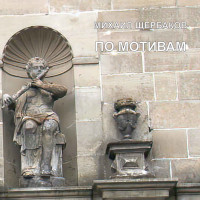

= По мотивам
Михаил Щербаков
2019
:toc:

From::
http://blackalpinist.com/scherbakov/Disks/ +
https://mkshch.com/

== Служба

[verse,2018]
____
Разве что залпом лишний кубок, 
сколько-то сверх пайка покупок – 
собственно, вот и весь проступок. 

Сладко шипело в кубке зелье, 
вышло не без греха веселье – 
собственно, вот и всё везенье. 

Ибо едва вкусил я мёду, 
к чёрному был готов исходу, 
сам на себя открыв охоту. 

Знал, что в ночи забывшись глухо, 
буду изловлен я, как муха. 
Грешнику поделом и мука. 

Думал, что сердца нет у старших, 
выдержанных, седых, уставших. 
Некогда им жалеть отставших. 

Заняты тем, что власть имеют, 
вряд ли они понять сумеют. 
Испепелят и прах развеют. 

Я о таком (а то и строже) 
много слыхал и ждал того же. 
Но получилось не похоже. 

Старшие мне сказали: ладно. 
Видно, что самому досадно. 
Значит, не будет впредь повадно. 

Смолоду всяк впадал в проделки. 
Всюду в пути развилки, стрелки, 
метки, зарубки редки, мелки. 

Правую спутал метку с левой, 
дал слабину, пленился девой – 
больше так никогда не делай! 

Завтра же заступай на должность, 
выкажи там опять надёжность. 
Вовремя приходи – найдёшь нас. 

Место тебе дадим по силам, 
сделаешь нам его красивым. 
Требует место быть не сирым. 

Цело ли всё на нём и цельно, 
служба должна следить прицельно. 
Собственно, тем оно и ценно. 

Если за ним не смотрит служба, 
вовсе оно тогда не нужно. 
Пасмурно там всегда и вьюжно.
____

== Неужели

[verse,2014]
____
Неужели свершилось? Вместо пятен возникли черты.
Всё, что зря копошилось, отрешилось от всякой тщеты.
Что ворочалось втуне, поразительно как расцвело.
Ведь ещё накануне совсем не могло.

А сегодня свершилось — бытие обрело колею
и тщета сокрушилась под своею же тяжестию.
И не верится даже, как подумаешь — только же что,
ну, буквально вчера же всё было не то.

А ведь было печально и вчера, и неделю назад.
Не везло капитально, несмотря на размах и азарт.
Уж какие, казалось, карты-козыри шли в переброс,
но игра не вязалась и проигрыш рос.

По колено в сумбуре то Минфин буксовал, то Минздрав,
в оборонной структуре не умели запомнить устав,
а структура надзора, подшивая к доносу донос,
от стыда и позора терялась до слёз.

Через дыры в кордоне утекал образованный слой,
через дыры в озоне атмосфера сочилась долой,
через дыры в законе плутовство умножалось везде,
потому что ничто не держалось в узде.

Населенье дичало, культтовары пылились лежмя,
никого не прельщала поутру по морозцу лыжня,
никому на закате не хотелось к реке с камышом,
не рыдалось во МХАТе, не млелось в Большом.

У танцовщика танцы вытанцовывались не вполне,
у рифмовщика стансы зарифмовывались тоже не,
виртуозу кларнета без отрады дуделось в дуду,
потому что не это имелось в виду.

Кружевные строенья заслоняла панельная муть,
с колеса обозренья прямо не на что было взглянуть,
а когда и случалось приманить пассажиров с детьми,
колесо не включалось, хоть до ночи жми.

А сегодня включилось, неподвижное всё завелось
и всему научилось, и вовсю этим всем занялось,
буксовать перестало, ощутило подспудный ресурс
и само угадало спасительный курс.

Разогнулся гвардеец, приосанился доктор наук,
просиял земледелец и налёг по-хозяйски на плуг,
подскочил архитектор — и бегом рисовать капитель,
обозначился вектор, наметилась цель.

Отыгрался картёжник, залаталась лазурная высь,
богослов и безбожник у костра над рекой обнялись,
а карающий орган, уловив надлежащий сигнал,
отвечает с восторгом, что так он и знал.

Снова стансы и танцы украшают собою дворы,
где на лавочках старцы не сварливы при том, что мудры.
А в потёмках подвальных молодняк не плюёт, не галдит,
потому что в читальных он залах сидит.

Всё послушалось правил, полюбило равняться во фрунт.
По звонку повар Павел кипятит в чугуне сухофрукт.
По гудку повар Пётр в макароны кладёт маргарин.
На кордонах досмотр, в Большом — "Лоэнгрин".

И, оставшись без места, одиноко скулит и снуёт
выражатель протеста, беспокойный поборник свобод.
Больше не с кем бороться, не в долгу он теперь ни в каком,
а ему всё неймётся побыть должником.

Он казнится, томится, уверяет, что честь на кону,
и долги он стремится возвратить неизвестно кому.
Делом, раз уж не данью, заплатить, попотев для людей.
Да иди же ты в баню, плати и потей.

В банях нынче опрятно, там приватно займутся тобой.
Там как раз не бесплатно и напитки, и сервис любой.
Там к очищенной водке ты в нагрузку получишь массаж,
и кредитка красотке уйдёт за корсаж.

Может хоть под парами усомнишься в апломбе былом.
Ты искал за горами, а успех невзначай за углом.
И найти очень просто, даже если к Москве не привык:
до Кузнецкого моста, а там напрямик.

Поздравляю, свершилось, и об этом я всюду и сплошь,
проявляя решимость, извещаю господ и госпож.
Пусть они по цепочке остальным сообщат господам.
Прилагаю цветочки, курю фимиам, припадаю к стопам.
____

== Интермедия 11

[verse,2017]
____
Сам себе инструктор, проницательный себе руководитель самому,
он посверкивает золотым секундомером на серебряном шнуре.
Пять минут на сборы: свиданье на площади в час,
красавица явится в срок. 

Или позже. Но заверит, что летела и спешила,
так что встречные гвардейцы еле-еле успевали 
оценить её изгибы и парфюм. М-м...

Лицемерка! - подытоживает он, противореча сам себе, -
не явлюсь на площадь. Ни к часу, ни к даже и к двум.
Пускай постоит-подождёт -

и вперёд не уповает на свои былые чары; 
пусть не кажется ей больше, не мерещится, как прежде,
будто чары эти столь ещё сильны, 

что я у них пойду на поводу.

И покачивает он тяжелой головою, глядя в метеопрогноз.
И покручивает ученически он глобус на серебряном штыре.
Отлучиться, что ли, в Европу на пару недель?
Теперь это недалеко. 

И - пожалуйста, что хочешь: Парфенон тебе, Акрополь,
Апеннины, Копенгаген, Трансильвания, Карпаты, 
Мариуполь, Мелитополь, Конотоп... Стоп.

Не поеду! - говорит он сам себе, перебивая сам себя, -
не без дёгтя сладость. Насмотришься на Колизей, 
наслушаешься баркарол -

и мерещится, что дома нынче тоже всё иначе, 
что - покуда ты в отлучке - всё местами поменялось;
устремишься растревожишься - и зря. 

Вернёшься в дом, а там - всё по местам.

И распахивает он на кухне холодильник, подтянувши рукава.
И замешивает овощную он экзотику в серебряном ведре.
Чудо тонкой резки. Изысканный деликатес.
Доволен собой кулинар. 

Вот бы чем-нибудь подобным на служебной вечеринке 
огорошить подчинённых, ковыряющих уныло 
волокнистые закуски и лангет. Нет!

Лучше вот как. И рецепт и всю посуду, всю затею целиком
поручить негласно надёжному секретарю 
(заранее премировав).

А потом при сослуживцах похвалить его погромче: 
дескать, вот кто наш умелец, не на шутку постарался,
чудо-блюдо изготовил, вот кто нам 

к столу сюрприз принёс. Не сам же босс.

И похрустывают под ножом ингредиенты. И посверкивает 
на серебряной удавке золотой секундомер.
____

== Колодец

[verse,2019]
____
Не вдруг в итоге двинулись вагоны,
и город отступил, пусть нехотя, за частью часть.
Прошли его фасады и фронтоны,
теряя вес и власть.
Прошли шумы его и перезвоны,
а также скарб и снасть.

Мелькнул разъезд, предместье миновалось.
Колодец-журавель возник и отлетел бескрыл.
И всё прошло, а что и оставалось,
то вскоре сумрак скрыл.
Оно уже иначе называлось,
и сам иным я был.

Я знал, что ни фасадов, ни колодца
не встречу, воротясь некстати, как дурная весть,
что нем вчерашний шум, и не очнётся
ни часть его, ни весь.
Что сам вернусь, а город не вернётся.
И вот я здесь.
____

== Интермедия 12

[verse,2019]
____
Такие школы есть в Москве,
не то их три, не то их две,
элитной марки, для сугубо одарённых.
Меня в одну из этих школ
зовут, чтоб лекцию прочёл,
о чём, зачем – не знают сами, но зовут.

Так я, пожалуйста, схожу,
но только что я им скажу?
Какая радость от меня, помимо грусти?
Они же молоды насквозь,
они надеются, небось,
и все на лучшее, а это чересчур.

Таких не очень развернёшь.
Я в прошлом тоже молодёжь,
бывало день и ночь не сплю, не ем – надеюсь.
Беру газету в сутки раз,
в газете ложь, как и сейчас,
но я вникаю и опять – не ем, не сплю.

По Красной площади брожу,
от нетерпения дрожу,
однако слышу лишь порой короткий ропот.
Затем короткую пальбу,
и снова тихо, как в гробу,
но я надеюсь каждый раз, как и сейчас.

Ходил на исповедь, пока
не подглядел исподтишка,
как исповедник диктофон под рясу прячет.
Платил психологу, но с ним,
когда бедой назвал я Крым,
случился шок, и я уж больше не платил.

Листал историков труды
насчёт источников беды,
нашёл, что главные – сумбурность и обширность.
Мол, будь поменее размах
и крепче мнение в умах – 
сейчас была бы, мол, держава хоть куда.

Но время думать головой
иссякло к Первой мировой,
а после думать стало некому и нечем.
Остались в вечной бедноте,
одни надежды – да и те,
такие смутные, что дети не поймут.

Ещё и высмеют: "Чудак,
всё это знаем мы и так,
читать умеем – не смотри, что вундеркинды!
Да и не сам ли ты, дружок,
беде способствовал, как мог?"
Тут будет пауза, а это чересчур.

И не пособник я ничей,
и плоскогубцев, и ключей
не подавал, когда закручивались гайки.
Но отзывается стыдом
и вспоминается с трудом.
Погибла лекция, хоть в школу не ходи.

Однако всё-таки рискну,
в глаза грядущему взгляну,
в иных глазах оно читается изрядно.
Сегодня школьник он – а там
уже полковник он, и сам
по школам ходит, вундеркиндов учит жить.

Сегодня влево он глядит,
там, слева, девочка сидит,
не сомневаюсь, что зовут её Надеждой.
Надежда, ты моя беда,
Надежда, я вернусь, когда
трубач отбой сыграет, то есть никогда.
____

== Троекуровский погост

[verse,2014]
____
Буквы на камне сквозь мох да репьи.
Имя, вроде, с отчеством нынче ничьи.
"Пётр Дормидонтович" — дальше трава.
Были с прописной — стали просто слова.
Были в позолоте, а выцвела вся.
Вглядывайся, путник, догадывайся.
Мрамор увесист, орнамент не скуп.
То-то, знать, усопший был большой душегуб.
Обер-прокурор или аншеф-генерал.
То-то он наотмашь казнил и карал.
Сколько неповинных столкнул под откос
он, покуда сам лебедой не порос.
Сколько он, покуда в суглинок не влип,
глоток перегрыз и хребтов перешиб.
Грыз бы и впредь, да, видать, изнемог:
звание с фамилией — и тех не сберёг.
Больше не кусается, даже не жужжит,
он на Троекуровском погосте лежит.
Доступ к погосту, обзор и обход
всякому зеваке открыт круглый год.
Всякого туда через пустошь и лес
вывезет маршрутное такси «мерседес».
Вот я — зевака — хожу, не страшусь,
буквы читаю и в небо кошусь.
Действует на небе главная власть,
мечет фортуна козырную масть.
Пусть пока мечет, потом разберём,
много ль было шансов не стать упырём.
Глянем, рассердимся: "Что за дела?
Шансы велики, а вероятность мала!"
Буквы на камне, камень в траве.
Прячет фортуна туза в рукаве.
Пётр Дормидонтович, кто ты такой?
Царство небесное, вечный покой.

По нашей-то расценке нынешней
признаем сверху вниз,
что даже на венок на финишный
ты лавров не нагрыз.
Подсчитываем нынче точно мы,
кто в роще первый зверь.
А где была трава с цветочками,
там ягоды теперь.
Завяла повилика сорная,
сопрела белена,
а выросла черника чёрная,
созрела бузина.
Ты попусту блестел погонами,
кокардами мерцал,
а нынче бы хрустел мильонами,
мильярдами бряцал.
Держался бы державной выгоды,
да всё себе же в плюс.
И орден бы имел за выборы,
и орден за аншлюс.
Конечно, мировая пресса бы — 
поскольку не глуха — 
зачислила тебя в агрессоры,
а ты в ответ: "Ха-ха!"
И всё бы на боках на глобусных
чертил меж полюсов,
куда ещё закинуть доблестных
невидимых бойцов.
Такую ты изнанку понял бы,
в такие вник статьи,
что даже может сам не помер бы,
пришили бы свои.
Воздали бы, конечно, должное,
хватило бы ума.
И место бы нашлось надёжное
для скорбного холма.
Досталось бы ему украситься
и камнем, и доской.
Казалось бы: какая разница?
И правда — никакой.
____

== Аптека

[verse,2019]
____
В лекарстве рутинном даром подвизаясь,
тщетность понимаю сам.
Нынче модный лекарь лечит, не касаясь,
как бы состязаясь с кем-то там.

Для его программы яды и бальзамы – 
слишком невысокий класс.
Лекарь нынче демон. Не узнаешь, чем он
снимет, наведёт ли порчу или сглаз.

Хворых он пленяет радужной опекой,
ловит в золотую сеть.
И готов подшефный стать скорей калекой,
чем с моей аптекой ладить впредь.

Что твои рентгены? Демон входит в стены,
комнатных пугая рыб.
Где такое шефство –  там моё волшебство
ничего не значит. Значит, я погиб.

Скоро оснастится модным реквизитом
весь уже врачебный цех.
А в моей аптеке будучи с визитом
грустный инквизитор скажет "Эх!"

Скажет так любовно, так печально, словно
горших не бывает зол.
"Что же ты, мошенник, лгал, что ты волшебник?" – 
скажет и заплачет. Значит, я пошёл.

Я пошёл, поплёлся, поспешил, помчался
строго к девяти ноль-ноль.
Демонскому делу кто не обучался,
кто не приобщался, тот – изволь.

Гляньте, ангел падший в класс начальный младший,
сдерживая смех и страх,
едет к первой смене в метрополитене.
Вместо крыльев тёмный скромный ранец на плечах.
____

== Чаттануга

[verse,2018]
____
Совсем не стало никаких принуждений,
не свищет плётка вслед ничья ни одна.
Не надобно властям твоих радений и суждений,
для формы только подпись кое-где иногда.
Хотя по сути не нужна и она.

Свободен, ибо никому не опасен.
Равно же и полезен мало кому.
Не нужно фраз, не важно, в чём вопрос, кивни: "Согласен".
Моргни по крайней мере – дескать, быть по сему.
А можешь даже не моргать, ни к чему.

Париж, Венеция, Шанхай, Чаттануга – 
пространство, понапрасну звавшее в путь.
Оно и ты доселе обходились друг без друга,
и впредь оно сумеет обойтись как-нибудь.
А ты от карты отвратись и забудь.

Не била разве жизнь тебя? Ох как била.
Имеешь право внуку дать нагоняй.
А ну-ка, внук, не трожь всего вокруг, оставь, как было,
само пускай погибнет, ничего не меняй
и даже после на себя не пеняй.

Ищи виновников других паки, паки,
пока своё же рвенье не утомит.
Шельмуй слоновью мощь, ругай неспешность черепахи
и тех же трёх китов, и всё, на чём свет стоит.
Не так уж долго шельмовать предстоит.
____

== Пикник

[verse,2017]
____
Хотя и зря вполне, но почему бы не. 
Изобразим подъём перед большим постом. 
На Покрова не шло, не задалось на Спас, 
на Рождество грешно, зато сейчас – как раз. 
Решила власть – айда, изобретём призыв: 
пускай людской массив придёт в лесной массив, 
куда-нибудь в Посад, к монастырю впритык, 
чтоб всё же митинг был, хоть и пикник. 

Хоть и впросак, ей-ей, для новостей окей. 
Любуйтесь, вот оно: толпа и власть – одно. 
А что пуста казна – зато весна красна! 
И монастырь динь-дон, и микрофон включён. 
Легко-легко с листа читает речь главарь. 
Весьма видать, что в детстве изучил букварь,
и в гору лез весь век, и тяжкий воз волок,
и по всему видать, что превозмог

Что произвёл развал, укоренил разбой, 
но присягнуть призвал, как бы само собой. 
Пока внутри погром – оно гори огнём, 
но припекло извне, так почему бы не. 
И мимо строк вприщур глядит он как в прицел, 
спасибо – пост, а то бы всех убил и съел. 
Не поперхнись, трибун, превозмоги, стерпи,
но от повестки дня не отступи. 

Едва дочтёшь слова да изречёшь посул, 
и в тот же миг – ать-два, на весь Посад разгул. 
Дотеребишь листок – и плясуны прыг-скок, 
и певуны споют – недорого возьмут. 
Кого-кого, а их режим пугал постом, 
ещё когда ты даже не шагал под стол. 
Вот и тебе, старшой, споют они с душой, 
мол, хоть и врёт шельмец, а молодец. 

Не загрустил, не сник, а закатил пикник 
во зеленом лесу, на голубом глазу. 
Заведено к тому ж: когда за гуж недюж 
или нашла коса – беги бегом в леса, 
где белый гриб меж пней и рыбий хвост в ухе, 
и кто ты есть видней на чистом воздухе. 
И на глазах у всех и присягнуть не грех, 
а что кольцом спецчасть – на то и власть. 

Держи фасон, трибун, ты хоть и врёшь, а прав. 
И барабан бум-бум, и фейерверк пиф-паф. 
Любуйся, вот оно, как это ни чудно: 
толпа и впрямь одно – другого не дано. 
Одной среды продукт, как рыбий хвост и гриб. 
В одном лице субъект, один типичный тип. 
И никаких личин ни у кого, заметь. 
И никаких причин, чтоб не запеть. 

Дискриминация, деноминация – 
всё ерунда, когда иллюминация. 
А рядом дочь и сын – горячие сердца, 
и никаких причин, чтоб не пойти в отца. 
Мотай на ус, главарь, не важно – пост, не пост: 
заботы нет, что хлипок под тобой помост. 
На Покрова ль, на Спас перекосит, тряхнет – 
а ты зови опять всех этих вот. 

Построишь их меж пней, устроишь им салют, 
они тебе, ей-ей, ещё не так споют. 
А надоест мотив – произведёшь щелчок, 
и сразу пуст массив, и всё вокруг молчок. 
И темнота окрест, ни почвы ни небес, 
один типичный виден тип, и тот не весь. 
Видны виски, рука, ботинок без шнурка 
и обречённый взгляд призывника.
____

== Времена года

[verse,2019]
____
Когда казалось, что ни в чём опоры нет
и белый свет не бел, и это хуже чем не мил,
себе твердил я: брось, всему ли виной унылый свет?
Каков бы ни был он, а ты его преломил.

Расположил в обрез на каждый божий день,
В семействе – как чужак, в столице – как в лесу.
Умножь на сорок лет, и вот – ни свет, ни тень
тебе и не по нраву, и не к лицу.

Само собой, очки, да много ль встроишь в них?
Учил бы оптику – досада бы теперь не жгла.
Начистоту сказать, не шибко ты ловок троечник
насчет падения, отражения и угла.

На солнцепёке вымок сплошь, прохлады ждёшь.
В осенней скуке весь поблек, скорей бы снег.
Но от него зимой завал, весной потоп,
и солнца не дождёшься потом, потом.

Кому от непогод хватает стен и крыш,
тому и в оптике всегдашний наготове трюк:
перевернул бинокль – и вот уже не чудовищ зришь,
а насекомых мелких, с лапками вместо рук.

Их комариный век угас, остался час.
Почти забавен их задор в преддверьи тьмы.
И через шестьдесят минут они уснут
и завтра не воскреснут, не то что мы.

А кто на трюки слаб – законы выяснит
и уловивши луч, его расширит и продлит,
чтобы когда потоп светила замкнёт и вытеснит,
не бормотать опять, что оптика барахлит.

Купил учебник в двух томах, азам учусь.
Успехи есть, хотя прочёл лишь первый том.
Ночами обхожусь без лампы, сам свечусь, 
и то ли еще будет потом, потом.
____

== Марш-марш

[verse,2019]
____
Из пепла былого и дыма
едва ли всплывет через век,
как мимо тебя всё другие, всё мимо
в машинах катились в Артек.

Как пели счастливцы беспечно
кто хором, кто сам, кто вдвоём,
и отзвук той песни навечно
остался в сознанье твоём.

С годами звучал он не тише,
тревожил, будил, оглушал.
Хотел ты и вровень с другими, и выше
подняться, но отзвук мешал.

В каких бы ни мчался машинах, 
ты слышал, как мчится в обгон
та песня о горных вершинах, 
и словно лишался погон.

И знал, что достигнуть способен
ты только такой высоты,
где ниже тебя только тот, кто подобен
тебе, или хуже, чем ты.

Другие на взморьях отмокнут,
оттают в тепле и в семье,
твои же обиды умолкнут
лишь вместе с тобою в земле.

Ведь даже прижившись во власти
и вдоволь украв и убив,
себя ты едва ли разнимешь на части
и вросший изымешь мотив.

Удастся тебе о вершинах
не раньше забыть, чем залечь
на трёх или меньше аршинах – 
смотря как: зарыть или сжечь.

Контора участок запомнит,
на схеме укажет – куда,
и самый безумный паломник
разыщет тебя без труда.
____

== Отъезд

[verse,2019]
____
Куда не нам чета отправкою заведует,
куда спешить иль медлить – всё не впрок,
доставь меня курьер на этот раз, как следует – 
не после и не до, а точно в срок.

Заранее проверь устройство для свечения
и сходу, как подашь карету мне,
включай на полный блеск, и пусть мои сомнения
сгорят в его лазоревом огне.

Поклажа нам зачем? В ломбард собрался, что ли, ты?
Любых торгов честней прямой размен.
Взаймы достаток взят, в отдачу слёзы пролиты,
к тому же я не в курсе новых цен.

Для форсу подгадай поближе всё же к полночи,
иначе зря мелькнет, едва видна,
карета, так сказать, неотвратимой помощи.
в потоке, в череде, ещё одна.
____

== West Coast

[verse,2019]
____
Да, это Запад, лицо его и душа.
Простор, знакомый по детской библиотеке.
Удобный фон, по-прежнему нужный людям
для перестрелки, погони и барыша.
Другое дело, нужны ли ему человеки?
Гадать не будем. То есть, конечно, будем,
но по приезде и не спеша.

Знаю пока одно: не всюду широк он, не весь прекрасен.
Явно порой опасен, но тесен ли? Исключено.

Так я в Китае когда-то недоумевал:
с таким населением – столько свободного места.
Отправлюсь в Индию – вновь удивлюсь тому же.
Дешевле сразу смириться, что не побывал,
и прямо вот здесь осесть уже наконец-то.
В любой случайной точке выйдет не хуже,
чем если впрок бы облюбовал.

Опыт своё берёт. Не вечен в скитаниях привкус чуда.
Высохнет – скажем "стоп", а покуда – "полный вперёд".

Роскошно едем, болтаем о ерунде.
Опять о еде, хоть позавтракали не рано.
О том и о сём, ненароком вдруг об отчизне
и, спохватившись, опять-таки о еде.
И так продлится до самого океана
на всём отрезке из общего плана жизни
от снежной сьерры к синей воде.

Словом, не ближний свет. Дешевле бы в справочнике про Запад
нормы осадков за год, ландшафты, запах и цвет.
____

== По мотивам

[verse,2019]
____
Пропал, пропал мальчишка, не видать ему диплома, как ушей.
Остаток юных лет потратит он в опасном далеке от Ленинграда.
С его фамилией свою через дефис не пробуй, девочка, не надо,
и к маю месяцу себе обновы свадебной ты загодя не шей.

Влюбилась ты в него за самобытность,
понравился за то, что не как все.
Когда все ехали в трамваях,
на чёртовом он ехал колесе.

Однако от задатков не прямой ли путь к заскокам?
И что мы видим, граждане, в досье на сорванца?
Одни скачки да выходки, да выпрыги из окон
и вот теперь почти побег почти из-под венца.

Да, за год раскатилось эхо в перечне порочном
от громкой той облавы в общежитье полуночном.
С тех пор молва вокруг юнца буквально ореолом,
везде он со скандалом и всегда со слабым полом.

Но в штабе ДНД о нем другой припомнят случай,
как шёл он в парном рейде, а шпана навстречу тучей.
Так он и в одиночку устоял, когда напарник
сослался вдруг на надобность и отбежал в кустарник.

Не робкого десятка, да не пышного достатка.
Ютится где-то чуть ли не в чулане мальчуган.
А дочка замдекана целиком и без остатка
из папиных хором готова чуть ли не в чулан.

Воистину о том, как зла любовь,
пословица придумана не в бровь.

Пусть не первая я и не пятая на счету на твоём, ловелас,
но не только сама виновата я, что вот это случилось у нас.
Так что если и после вот этого ты уедешь пахать целину,
я пойду на канал Грибоедова и в холодной воде утону.

Покуда не решил я – целина, не целина,
но свадьбы не хочу ни по любви, ни для потехи.
Напрасны ахи, охи все твои, а также эхи.
И в ЗАГСе мне не место, и на курсе грош цена.

Во цвете лет уже в мозгу надлом, не то усталость.
Учился бы охотно, узнавал бы, только дай,
но с памятью беда, и всё, что год назад читалось,
уже теперь хоть заново читай.

Пред мраком забывания 
бессильно все старание,
и радость узнавания 
омрачена заранее.

То-то от конспектов чужих скулы сводит,
силы нет терпеть факультетских зануд.
А секунды тикают, молодость уходит,
скоро вся уйдёт, поминай как зовут.

Чем лишний год гонять балду 
на очном отделении,
уж лучше я служить пойду 
в зенитной артиллерии.

А ещё бы лучше в артель скоростную,
ту, что от пожаров спасает тайгу.
Выручал бы фауну, в том числе пушную,
приносил бы пользу, а здесь не могу.

А ты ступай в киноартистки (хоть и конкурс).
Тебя возьмут за красоту (талант не нужен).
Научат плакать и смеяться (по сигналу, без причины, во все горло),
отвыкнешь писем поджидать.

Телеграмма два раза в год, 
так и драма на нет сойдёт.
Письма распаляют и нервируют,
утомляют и компрометируют,
стиль подводит, почерк выдаёт.

Ой, мама, что же мальчику неймётся,
ведь многое уже разрешено.
Все радуются спутнику, танцуют, как придётся,
и смотрят аргентинское кино.

На Лиговке напротив райсобеса
открыли новый женский монастырь (ой, мама), 
а отроку взбрело на фоне мира и прогресса
осваивать Восточную Сибирь.

Эх, дочка, и чему тебя учили в средней школе?
Неужто было трудно выбрать меньшую печаль?
Связалась без оглядки с баламутом в ореоле
и ехать отказалась на всемирный фестиваль.

Ведь этак можно долго ждать, пока сойдутся звёзды,
и слепо прозевать, и горько плакать, прозевав.
А ну как из Москвы тебя куда-нибудь увёз бы
какой-нибудь плечистый скандинав.

Однако, чем напрасно слёзы лить,
попробуем безумца вразумить.

Допустим, он герой, дружинник и т. д.,
но стоит ли прощать ему такие па-де-де?
Чулан ему как раз, хоромы не нужны,
тайги желает он взамен учёбы и жены.

Срывает он госплан, снижает кпд.
Все в Питер за вакансией, а он в Улан-Удэ.
Какой-то прямо ребус, и ответа нет в конце,
но мы-то уж найдём подход к вопросу о юнце.

Оденься, дочка, поскромней, прикинься некапризной,
в бюро на курсе обратись и весь их кодекс вызнай.
Пускай актив по кодексу мальчишку пропесочит,
опять же по учебной части папа похлопочет.

Да он уже хлопочет по-людски и по-советски.
На лето съехать он решил на дачу в Сестрорецке.
В медовый месяц будет вам квартира для простора.
Уже на даче всё кипит и выкипит не скоро.

Минуты нет свободной впереди,
и многого от папы ты не жди.

Замки на даче дрянь, заборы все гнильё,
а папа убеждён, что всюду воры и жульё.
Заметно истощив и нервы, и карман
уже бригаду нанял он непьющих мусульман.

Уже он перевёз туда грузовиком
и мебель довоенную, и клетку с хомяком.
Да в деканате он смягчит скандал и ореол,
однако ребус в целом пусть решает комсомол.

Конечно, пусть решает, тут я, пожалуй, рад.
В активе всё знакомцы, авось не навредят.
Авось не вмиг забудут, что были мы друзья,
дерзай, младое племя, тебе вверяюсь я.

Ну да, друзья, ну да, конечно, были,
ведь это мы облаву отвлекли
и весь твой рейд геройский сочинили,
и в ДНД тебя приволокли.

А чтобы штаб не щурился дотошно,
мы на твоё нахальное лицо
лиловый бланш поставили нарочно
величиной с пасхальное яйцо.

Нам дела нет, прогуливай истмат и физкультуру,
со скидкой у фарцы бери шмотьё с чужой ноги.
Девицы около тебя пускай толкутся сдуру,
смущай, каких захочешь, только наших не моги.

А ты смутил и Машку, и Наташку,
и уж когда настанет судный час,
мы заклеймим штаны твои в обтяжку – 
таким штанам не место среди нас.

Машка, Зойка – один ответ.
Пряжка, Мойка – не клином свет.
Заросли таёжные звериные, залежные земли и целинные
ждут меня теперь, а город нет.

Безумец, в понедельник на активе твой вопрос,
а ты и накануне все не выглядишь безвредным.
Сегодня видели тебя опять с каким-то бледным.
Он циник и маклак, опять моих ты хочешь слёз.

Ох, девочка, уже неважно, где, когда и кто с кем,
и хватит причитать по мне, как в "Слове о полку".
Уже поклон отвесил я Елагину с Крестовским,
уже долги Васильевскому отдал островку.

Все, все свернул дела на личном фронте я,
вопросы снял и прения закрыл.
Ведь я сказал тебе, что не влюблён в тебя.
Не говори, что я не говорил.

Но, знаешь, раз уж послезавтра чёрный понедельник,
давай хоть в воскресенье отгуляем весело.
Займу-ка я у бледного немного мятых денег,
махнём с тобою в Павловск или в Детское село.

Неисправимый ты обманщик, огорчил меня опять.
Договорились мы с тобою на одиннадцать ноль пять.
Но загудела электричка и умчалась насовсем.
Ты не пришёл и не придёшь, уже одиннадцать ноль семь.

Одиннадцать ноль восемь... Одиннадцать ноль девять...
Одиннадцать ноль десять... Одиннадцать одиннадцать... 

Увы, увы, стремился, собирался быть я к сроку, но размяк.
Неделя выдалась ущербная, и надо же – как раз без воскресенья.
Переломился, потерялся я, и нету мне прощенья и спасенья,
тогда как бледный не ударил в грязь никак, хотя и циник и маклак.

Он сразу, как услышал сумбурный мой сюжет,
провел меня дворами в Асторию в буфет.
И взявши для разбега четырежды по сто,
ответил мне подробно, и в частности вот что.

Огонь, вода и трубы или скрипки – 
что выберешь теперь, тому и срок.
Твоя натура в поиске, тебе нужны ошибки,
но девочке такое невдомёк.

Сегодня решено, не переменишь,
а завтра зачеркнёшь и запретишь.
Учтёшь хотя бы фауну, которую так ценишь,
и стало быть, её резоны чтишь.

То-то строит гнёзда и семьи заводит
рыба краснопёрка и птица удод.
В общем, делай выводы, молодость уходит,
всё она уходит, никак не уйдёт.

Забыл, где пили после, покатился, словно с горки.
Спасибо, рёбра целы, уж какой там ореол.
Не помню, как вернулся, но будильник местной сборки
завёл на полвосьмого, и будильник не подвёл.

В итоге утром, встав мертвей покойника
и глянув на рассвет в окне, красивый, как закат,
я выпил воду всю из рукомойника
и к месту казни прибыл в аккурат.

Актив сидел на первом этаже
с готовой резолюцией уже.

Два тонких листика – характеристика:
махровый плут, моральный инвалид.
Нельзя, чтоб сам от нас ушёл он чистенько,
пусть коллектив его приговорит.

За фанаберию свою кошмарную
и святотатственный подрыв основ
пусть отправляется в тайгу угарную,
в артель ударную, чей быт суров.

Кружка, ложка, брезент, асбест...
Знала кошка, чьё мясо ест.
Пусть переживает испытания, 
нужные для перевоспитания.
Точка, пишем дату, ставим крест.

Уйти я мог без звука, однако у дверей
не выдержал и брякнул: вас больше, вы сильней.
На всякий час и повод найдёте вы слова,
но кто согласен с вами помимо большинства?

Где ваше то святое, на что я посягнул?
Гоните, отчисляйте за неуд и прогул,
но утверждать, что злостный я варвар и вандал,
какое ваше право и кто его вам дал?

Зачем сказал я это и что имел в виду
осталось мне неясным, равно как и суду.
Не оттого ль, пока я незнамо что молол,
незыблемые судьи молчали, глядя в стол?

Не пустились в разнос, не разгневались,
лишь ухмылка на ртах замерла,
и густая зелёная ненависть
в комсомольских очах зацвела.

Потом-то главный комсомолец, тоже бывший друг,
вдогонку выбежал – хотел понять детали.
Но с ним в детали мы вдаваться, нет, не стали,
хватило реплик ровно двух.

Он мне сказал: вопрос решён давно.
А я ему сказал, кто он такой.

И потопал я в чулан тосковать,
а комсорг пошёл себя страховать.
Он к конторе повернул к страховой,
было, видимо, ему не впервой.

Тут и там страховщики по пятам
обещают помощь нам, гражданам.
От огня мол, если что, сберегут,
а откажешься – смотри, подожгут.

Но не о том я думал, воротясь в чуланчик тесный,
какая мне за подвиги назавтра светит честь,
а думал я, иным ли миром станет мир окрестный
десятилетий, скажем, через шесть?

Придётся ли с нечистой силой знаться там?
Кто выручит, когда в тебе пожар заполыхал?
Я грезил о две тыщи восемнадцатом
и стука в дверь, забывшись, не слыхал.

А итог банальный, не скрою его я.
Ни при чём тут ребус, бином и Ньютон.
Отыграли свадьбу, родилася двойня,
близнецы и тёзки Артём и Антон.
____

== Песня о колёсах

[verse,2018]
____
К чему искать ночлег, покуда не стемнело?
Скакать бы дальше, да кибитка устарела.
Хватило ей кривых дорог. Ободья сбились.
Попутной песне вышел срок. Слова забылись.

Умолкнет скоро и мотив за нотой нота.
Уже он дольше срока прожил для чего-то.
Зачем-то случай уберёг его и пеплом не занёс,
отмерив нотам век иной, чем у словес и у колёс.

Сегодня, вслушиваясь в ноты эти снова,
напев кузнечика я вспомнил непростого.
Не одного из рядовых зелёной братии,
но легендарного из школьной хрестоматии.

Земною он в полях заботою не скован,
Он на полях пером умелым нарисован.
Двойник художника, но лучше, чем художник, потому,
что никого не просит ни о чём, не должен никому.

С годами контур потускнел. Черты не те же.
Ещё звучит напев, но тише стал и реже.
Во всём оркестре он - малейший подголосок,
набросок, стёршийся, как песня о колёсах.

В потоке шумном капля он, иголка в стоге,
и завтра вновь его не  вспомню я в дороге.
Не различу в ночи, сверяя курс по звёздам и луне,
когда послышится в тональности привычной или вне,

попутный, встречный ли
сверчка ли, кузнечика ли,
привет всему оркестру или мне.
____

