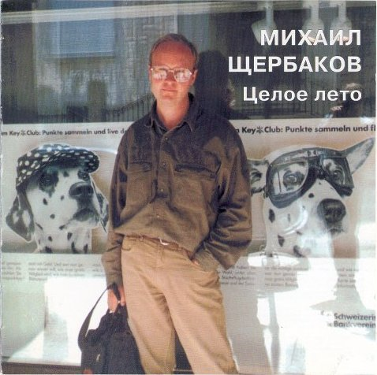

= Целое лето
Михаил Щербаков
1997, 2005
:toc:

From::
http://blackalpinist.com/scherbakov/Disks/ +
https://mkshch.com/

== Поводырь

[verse,1995]
____
Право, пора, поводырь, проснись, голову подыми,
стан распрями да выгляни, наконец, в окно.
Отчего так пахнет снаружи кузницей и лошадьми
и слова долетают сельские: «жмых», «толокно»?

Помнишь ли ты хоть имя того, кто нам дал ночлег?
Надо бы восвояси, но нет, всё гостим, гостим.
Ладно покуда осень, тепло. А выпадет снег -
что мы будем делать с тобой, милый мой Августин?

Впрочем, и дома теперь бы ты наверняка скучал.
Всё бы писать собирался, варьировал бы нажим.
Всё бы молчал среди пепельниц, бумагу бы размечал,
ввысь бы глазел, и небо тебе казалось бы не чужим.

Жаль, не видал ты его оттуда, с тех галерей,
меж каковыми и мой был протянут канатный шлях.
Страшное небо, страшное небо, нет ничего страшней.
Чёрные бывают в нём ангелы, с кортиками, в вензелях.

Я ведь не век на согнутых шаркал, кочек боясь и дыр.
Раньше-то важно шагал, вышагивал, вышивал по канве.
Но налетели чёрные, справились, выбили балансир.
С тех-то я пор иначе как ощупью уж и не двигаюсь по Москве.

Трогаясь с места, дёргаюсь. Выветрился, иссяк.
Весь обмелел, как рекам иным не грезилось и во сне.
Будет ли так и впредь? Допускаю, что будет ещё и не так.
Если писать соберёшься всё же, то не пиши обо мне.

Или пиши, но по методу дядьки и бузины, не шлифуя фраз.
Слов не вяжи, пускай не стыкуются, не имеют лица.
Вроде того, что, дескать, тенденции упразднены. Септаккорд погас.
Ягодой, мол, валяется легенда бывшего колеса.
____

== Это не я

[verse,1996]
____
Неосторожно взяв почин впредь обходиться без личин,
склеить пытаюсь два словца от своего лица.
Битые сутки с тяжким лбом сиднем сижу, гляжу в альбом.
Что до словес - язык не враг. Что до лица - никак.

Вот гувернантка, с ней дитя, милый ребёнок. Но, хотя
брезжит повадка в нём моя, всё-таки он не я.
Вот шалопай в Крыму меж скал, менее мил, уже не мал,
скачет вождём земли всея. Только и он не я.

    Вот и опять не я, а он - в Санкт-Петербурге меж колонн,
    вовсе не мал, давно не мил, к Бирже спиной застыл.
    Тщетно он ждёт, когда Нева скажет ему «коман са ва»,
    волны идут себе как шли. Выкуси, вождь земли.

    Дальше не лучше. Вот, кляня - тоже себя, но не меня, -
    он на одной стоит ноге в очень большой тайге.
    В обувь к нему, зловещ и дик, вирусоносный клещ проник.
    Знаешь ли ты, что значит «клещ»? Это такая вещь.

Снова не я, а тот, другой, пред микрофоном гнёт дугой
корпус и разевает рот, думая, что поёт.
Можно ручаться по всему, тут со щитом не быть ему:
скоро из уст исторгнет он стон и метнётся вон.

Вот он в «Арагви», без щита, розовый после первых ста.
Знаешь ли ты, что значит «сто»? Это, брат, кое-что.
Только и тут на сходстве черт нас не лови, молчи, эксперт.
Это не я, пускай похож. Ты, академик, врёшь.

    Это другой отцом родным держит себя, пока над ним
    обыск чинит от глаз до пят целый погранотряд.
    Двое с овчаркой с двух сторон лезут в багаж его, а он
    молвит, ощупав Рексу нос: «Пёс-то у вас - того-с!»

    Это другой, два дня спустя, Бруклинский топчет мост, кряхтя.
    Топчет и ропщет в смысле том, что утомлён мостом.
    Либо взамен «коман са ва» в скором купе «Париж - Москва»
    шепчет, припомнив Мулен Руж: «Боже, какая чушь!»

...Снимок за снимком, дым, клочки. Скулы, виски, очки, зрачки.
Дети, отцы, мужья, зятья. Кто же из оных я?
Разве, быть может, тот, в углу, что, прижимая лёд к челу,
битые сутки, гриб грибом, тупо глядит в альбом.

Может быть, он моим сейчас голосом ахнет, вместо глаз
к небу поднявши два бельма: «Боже, какая тьма!»
Может, хотя бы он - не дым. Впрочем, тогда - что делать с ним?
Сжечь? Изваять? Убить? Забыть? Может быть, может быть.
____

== Switzerland

[verse,1996]
____
Чуть свет на днях Борей пронзил
ландшафт - и правил бал, но миг 
всего. Он лют, но краток был.
И вот исчез. И нет его.

Фонтан, что бил в саду, застыл
в момент. Из брызг и струй возник 
кристалл. Чуть свет я сам следил,
как таял он и как блистал.

Левкой зачах на час. Но вот -
прошло. И вновь он свеж, сребрист 
и юн. Так смерть - дохнёт, мелькнёт -
и нет её. Опять июнь.

В горах пасут овец. И я
не прочь взойти туда, взглянуть: 
ужель и впрямь Гельвеция
с вершин видней иных земель?

Зачем ты, пастырь, мне грозишь
бичом? Я не имел в виду 
вреда, отнюдь. Хотел я лишь
спросить, куда идут стада.
____

== Не знаю, как там ландыш...

[verse,1995]
____
Не знаю, как там ландыш, засверкал ли рябью росной.
Не знаю, как там Веспер, весь ли высью смыт небесной.
Картину дня, сдаётся мне, придётся дать неясной,
в слепых ещё лучах, при первом робком блеске дня.

Не знаю, мрамор как, остыл ли впрок, готов ли к зною;
здоровы ль бургомистр, его мадам и иже с нею...
Что, граждане спокойно ль спят, тем более не знаю.
Но знаю, что один из них от сна уже восстал.

                  Один из них
уже восстал - и прочь от прочих, кои спать горазды
(за что и шлют их, кстати, сплошь на форумы и съезды),
идёт он, бодр, хотя почти всю ночь смотрел на звезды.
В руках перед собой несёт словарь заморских слов.

Не знаю, как там лет гам, как лет гам там, как там Гамлет,
схватился ль за кинжал иль до сих пор в сомненьях дремлет?
Не каждый внемлет призракам. Но кто уж точно внемлет,
так это наш знаток заморских слов, сомнений нет.

                  Сомнений нет,
близки ему и замок Эльсинор, и остров Родос.
Он чует сдвиг эклиптик в должный час на должный градус.
В вещах он ценит атрибут, но также чтит и модус.
Сенатор-мавр и люмпен-скиф равно родня ему.

Маршрут его ведёт меж тем к реке или к карьеру,
где транспортное средство ждёт его об эту пору.
И вот, наивный как ботва, задумчивый как гуру,
в кабину он словарь кладёт и следом лезет сам.

                  И лезет сам.
Кабина сто очков иному крову даст по праву:
по леву руку левый борт и правый борт по праву,
а в центре на стекле портрет весьма раздетой фрау.
Ценитель слов ничуть не чужд подкожных нежных чувств.

Не знаю, как там люмпен, взят ли в рай, внедрён ли в Хаос.
Не смыслю корректив, какие в этнос вносит Эрос.
Но знаю, что, чуть в небо ткнёт перстом пурпурным Эос,
уже знаток вокабул - у руля, прошу взглянуть.

                  Прошу взглянуть:
не в лодке рыбнадзорной режет он камыш, и груз его - не почта.
Открытый океан пред ним, и криминальное таится в трюме нечто.
И ватерполоса какого хочешь цвета, и какая хочешь мачта.
Буссоль, секстан, квадрант, бом-брам-рей-грот-шкот - всё при нём.

Не грунт ровняет он, трясясь в машине типа грейдер.
В ландо без верха давит он на газ, как «изи райдер».
И мчатся с ним в ландо Брижит Бардо и Роми Шнайдер.
Когда мотор заглохнет... впрочем, нет! такого я вообразить не в силах.
____

== Циркачка

[verse,1996]
____
Дрожь унялась. Казнь миновала.
Он далеко. Горше не будет.
Ты молода. Время целебно.
Прочее всё - снег прошлогодний.
Ну, пренебрёг. Что уж теперь-то
толку в слезах? Лишняя сырость.
Всё-таки был, не показалось.
Может, оно даже и к счастью.

Если б не он, ты б не умела
петь снегирём, выть по-собачьи.
Год напролёт ты с кочевым бы
цирком теперь не кочевала.
Хлеб да вода. Медные деньги.
Чем не житьё? Что ж ты не рада?
Что всё сидишь - молча да молча,
тушью черня раннюю проседь?

Ахнет ли где звонкая сбруя,
выстрелит ли хлыст вольтижёра -
всё об одном ты вспоминаешь.
Всё позабыть не соберёшься,
как в роковой тот понедельник
он всполошил сонную дворню:
«Эй, лошадей!.. Ночь на исходе».
И укатил. Не оглянулся.

Ну, не любил. Вольному воля.
Грех не большой. С кем не бывает.
Право, забудь. Экая важность!
Не вспоминай. Лучше возьми вот
горсть серебра. Завтра в Варшаве
купишь себе новую ширму.
Эй, лошадей! Ночь на исходе.
Чёрт бы побрал эти ухабы.
____

== Надпись

[verse,1996]
____
Прежде, чем вовсе откажет рука, запишу: 

значит так, замедляет шаги
кровельщик, за угол поворотя.
Холодно. Ворохи сыплются с крыш.
Ставни колеблются. Плачет дитя. Уа-уа.

Ветрено. Веет невзгодой. 
Что, кровельщик, медлишь? Готовь инструмент.
Ворохи сыплются. Нужен ремонт. Инцидент

надвигается как «цеппелин».
Кошка два дня уже ни мур-мур.
Трещины в стенах узлами к узлам
вяжут тенёта, плетут свой муар и ажур.

Трубы гудят человеческим голосом, я различаю слова.
Не различал бы - не ныла бы так голова.

Вроде бы сетует душегуб:
жаль, мол, свидетеля не добил...
О, где же ты, легион-гегемон?
Есть полигон для стремянок твоих и зубил.

Выпрыгнуть бы, обмануть западню,
скрыться, пока широка ячея.
Нет, не получится. Руки не те.
Холодно, кровельщик. Плачу и я. Уа-уа.

Слёзы рекой. Не богемный квартал, а какой-то приемный покой.
Немощь моя, бубенец шутовской. Уа-уа.

Впрочем, ещё, может, и ничего.
Может, я попросту не привык.
Вот и прилип к слуховому окну,
к трубам гудящим прильнул, к дымоходу приник.

Нравятся, что ли, мне танцы теней?
Тоже, подумаешь, балетоман.
Так себе музыка на этажах.
Ставни колеблются, шарит сквозняк по домам.

Тени танцуют. Фальшивит гармоника. Странно, что кошка молчит.
Мнётся муар и морщит. Боже праведный.

Раз уж не выпрыгнуть, может - вспылить?
Выкрикнуть варварски: «Vive le Roi»?
Где эта улица, где этот дом?
Долго ли комедианту сменить амплуа?

Способов больше чем надобно. Яду вон - полная ампула.
Жребий, монетка, решётка. Была не была.

Поздно придут они, но придут.
Спросят без юмора: «Где этот дом,
где эта улица? Мы мастера.
Поздно, не поздно, а глянец мы тут наведём».

И наведут. Придадут колорит.
Отретушируют. Снимут леса.
Только и после во вновь обжитых
трубах бессвязные будут гудеть голоса:

- Кровельщик, я ухожу в небеса. 
- Хорошо, уходи в небеса.
Четверть часа на формальности, четверть часа.
____

== Кордебалет

[verse,1996]
____
Плохо кончилась атака. Я поднимаю флаг. Весь он бел.
Бел и я, но цел. Однако не понимаю, как уцелел.
Сил не то чтобы избыток. Хвастать-куражиться не спешу.
Но держусь уже без ниток. Мне даже кажется, что дышу.

Горло горна рвётся гордо. А и его вокал - не в цене.
Слыша звон, я знаю твёрдо: этот ваш колокол - не по мне.
Если что и жмёт мне шею - чёрная метка лишь. Да и та...
Эй, на стенде! Что с мишенью? Марионетка, бишь, да не та.

Что ж, вот и ответ. Хоть и не враз, но прочли.
Две тысячи лет даром для нас не прошли.

Был вояка, сплыл вояка. Молвил «желаю благ» и взлетел.
Плохо кончилась атака. Я поднимаю флаг. Весь он бел.
Чей не выбит номер в тире? Только ли мой - меж стрел, за каймой?
Нет, летят ещё четыре. Вон и шестой взлетел. И седьмой.

Наш кордебалет движется прочь от земли.
Две тысячи лет даром для нас не прошли.

Так легка душа вне пепла, так независима от кротов,
что случись теперь хоть пекло - bravo, bravissimo, я готов.
Рыть канавы, гнуть подковы, и камнепад терпеть, и чуму -
пусть велят, мы все готовы. Да не велят теперь. Ни к чему.

Всё, хватит побед. Поштурмовали, пожгли.
Две тысячи лет даром для нас не прошли.

Ни единым объективом не наблюдаемый никогда,
берег вырос над заливом. Необитаемый, как звезда.
Он раскинулся свободно, млечною полночью осенён.
Надо думать, что сегодня он будет полностью заселён.
____

== Ещё заклинание

[verse,1996]
____
Длятся стансы, шьются. Клякса, прочерк, штрих.
Трефы, бубны, шар лотерейный, счастье с блюдца.
Милые эти фанты, люблю я их.

Лепишь, вроде, лепет. Ловишь воздух ртом.
Вроде вздор. Но чу: в парадном шаги и трепет.
Вот оно, заклинанье-то, было в чем.

Кто там? Гости? Здрасте. Встанешь, глянешь. Ах.
Лунным бликом дама входит, неясной масти,
новость несёт, волнуется. Вся как взмах.

Новость - чистый триллер. Бойня номер пять.
Есть, мол, некий гангстер. Мюллер по кличке «Шиллер».
Он-де намеревался меня взорвать.

Шиллер? Как же, знаю. Был здесь только что.
Мебель в норме. Разве чуть обгорела с краю.
Он положил взрывчатку не в то кашпо.

Альфа, бета, гамма. Крибле, крабле, бумс.
Гнаться? Драться? Снять с него скальп? Ну что вы, дама!
Он уже сел в метро или троллейбус.

Взвесьте, дама, дважды. Это ж был бы мрак,
если б, то есть, я - вот тут же, сейчас, при вас же -
взял бы алмазный круг и точил тесак.

Факты против, факты. Люди, годы, жизнь.
Мне ли мчаться вскачь, кого-то хватать за фалды?
Ах ты, кричать, пиноккио! Ну, держись.

Альфа, бета, гамма. Квинтер, финтер, жес.
Раз уж драма, то не гиньоль, умоляю, дама.
Пусть водевиль, уж если нельзя без пьес.

Факты, фанты. Ладно. Люди, годы. Пусть.
Бросьте, дама, всё ли под этой луной досадно?
Выпьемте «Bloody Mary», забудем грусть.

Пять ли действий в пьесе, шесть ли, после - тьма.
Пусть мы, дама, лучше сперва потеряем в весе.
А уж потом, извольте, сойдём с ума.

Длится шепот, вьётся. Снится гному гном.
Он же - джокер, Шиллер, Мюллер и кто придётся.
Вот оно, заклинанье-то, было в чём.
____

== Кинематограф 2

[verse,1996]
____
Если эта светотень по жанру и не Мона Лиза Джиоконда,
пусть. Зато она твоя, пигмей, она для всех, не только для бомонда.
Даром, что ли, вместе с залом, путающим - в кадре он или за кадром,
ты при нежной сцене веки трёшь, а при батальной кланяешься ядрам?

Карлик! Хватит уже моргать, найди себе героя -
и выдавай за него себя.

Все позволено - серьёзный блеф и несерьёзный, типа контрабанды.
Прыгать можно вопреки команде, по команде или без команды.
Стиль по выбору, у нас кино немое: здесь живи или в Камбодже,
вздор мели какой угодно. Или не мели, эффект один и тот же. 

Эй, кхмер! Чем нехорош Пномпень? Найди себе героя,
сиамским братом его зови, но только чтоб негромко:
не забывай, что у нас сеанс.

В кадре - правильный как десять заповедей, грузный как четыре танка -
хмурит плешь американец: нынче от него ушла американка.
Кстати, вот она, в соседнем кадре, опасаясь выступить за рамку,
мягким шагом взад-вперёд, похожая на львицу, мечется по замку.

Львица! Хватит уже мелькать, найди себе героя.
К тому же, вроде бы, вот и он.

Крупный план, ряды немеют, в музыке само собой diminuendo.
Шутка ли, живой кумир, ещё-ещё не мёртв, уже-уже легенда.
Нечто в нём не то от лорда Байрона, не то от короля Георга.
Школьница - ряду в седьмом, похожая на птицу - бьётся от восторга.

Птица! Хилый в Георге прок, найди себе героя,
да не теперь, а в каком-нибудь круизе кругосветном.
Пускай за тысячу миль отсель на влажном побережье
тебе он скажет примерно так:

«Леди, я не уроженец этих островов, и вы не уроженка.
Но - вы любите цветы, а я люблю цвета приятного оттенка. 

Купим хижину к воде вплотную, где песок не жёсткий и не жаркий.
Стены выкрасим в маренго, мой любимый цвет, не броский и не маркий...»

Вспышка рвёт пастораль в куски коротким замыканьем.
Кинопроектор дымит вовсю, как шашка дымовая.
С американцами сильный шок, рыдают камбоджийцы.
«Ужо тебе, - говорят они, - ужо, великий Будда!
Ты изобрёл мировую скорбь. Зачем ты это сделал?»

И что же слышится им в ответ?
____

== Волк

[verse,1996]
____
Ты - чёрный волк. В должный час вспомнит о тебе
ад. А пока привыкай вздыбливать тарзанью
шерсть, письменам не внимать, верить осязанью.
Огнь, ореол, океан - всё это тебе.
В шторм должный курс не однажды бизанью
мёртвый голландец укажет тебе.

Плен победишь, и холмы встанут пред тобой.
Но, на холмах не узнав Иерусалима,
так и пройдёшь сквозь врата, только что не мимо,
в храм, где как раз в этот час радужно-рябой
пёстрый витраж сам собой, без нажима,
брызнет и блёстки взметнёт над тобой.

Букв не поймёшь. Но словарь втиснет и тебя
в свой дом сирот, в толчею чётных и нечётных
глав. Клевете личных дел, мрачных подноготных
в тон подпоёт клевета басен про тебя.
Плоть неизвестных, безвинных животных
с детства навязнет в зубах у тебя.

Долг платежом - там, в конце. Это не шучу.
Огнь письменам, сироте гривенник и ёлку.
Там - бледной ли бездари, чёрному ли волку -
дам поделом. Нипочём не переплачу.
Всем от того витража по осколку.
Скупо, нелепо. Но я так хочу.

Я - чёрный волк. Никого нет, кто бы помог
мне эту речь прекратить не на полуслове.
____

== Целое лето

[verse,1996]
____
Что изменилось в эти двенадцать месяцев, угадай с налёта.
Правильно, ничего почти или очень мало. Пустой был срок.
Публика шевелилась довольно вяло, пыхтя созидала что-то,
после пыхтя ломала. В итоге минус, но он не весьма глубок.

Да, кое с чем обошлись неловко, в чём-то перестарались где-то.
Кафель опять приклеили как-то криво, не там прокопали рвы.
Жителей стало больше, порядку меньше. И речь не о части света:
в Африке климат мягче, но люди едва ли проще, чем я и вы.

Меж тем - закончилось целое лето. Увы.

Не изменилась та, от чьего нытья бешусь, у чьего бедра вьюсь.
Не изменился я, от чьих буриме она валерьянку пьёт.
Год ей не по душе и не нравлюсь я; так я и себе не нравлюсь,
но буриме-то - что ж, непременно в печку, раз неудачный год?

Кроме литературы, чем и дышать, опускаясь на дно морское?
Чем и внушать себе, что после дна - ещё одно, и земля не шар?
Чем утешаться, слыша, как год от года пуще грозится кое-
кто досадить по первое нам число, вгоняя в озноб и жар?..

Первое! А нынче уж вон какое. Кошмар.

С литературой, правда, как раз дела вокруг обстоят не кисло.
Что ни столбец газетный, то и сюжет. Мольер тебе и Гомер.
Смысл объявился вдруг там, где и мух не водилось, не то что смысла.
Что ни сюжет, то ребус. Хоть помещай в задачник. Ну, например.

Мать и отец тайком собирали хронику супротив тиранства.
Сын-семиклассник знал, ибо рос внимательным. Только плохо рос.
Так что, стесняясь роста, пока тянул сантиметров на полтораста,
не доносил. Потом до ста девяноста вымахал и донёс.

Чем время нравственнее пространства? Вопрос.

Впрочем, я не о времени, я о себе, о частных своих проблемах,
о языке насущном, а не о слоге, который сидит в чалме.
Действовать ли мне дальше? И если действовать, то в каких морфемах?
Тоном каким бравировать, молодецки глядя в глаза зиме?

Я по-советски пробовал. Не далось, мешал аромат кутузки.
Пробовал по-московски - расползлось по швам, оторви да брось.
Много платя за транспорт, и по-ростовски пробовал, и по-тульски:
взять в оборот хотел неродное слово. Приступом не взялось.

Ладно, попробуем по-пластунски. Авось.

Эх, голубые ёлочки, белый снег, вдалеке с бубенцами тройка!
Публика шевелится довольно бойко, мало кого штормит.
Впрок идёт заготовка дров, успех имеют шитьё и кройка.
Может, мои мне опыты стоит впредь подписывать «Юнкер Шмидт»?

Нет, до поры не буду, помедлю минимум до конца куплета,
в коем: я, угловат и хладоустойчив (этакий эскимос),
еду всё тем же транспортом без билета. В зубах у меня галета. 

Жизнь дребезжит, подпрыгивает и воспринимается как курьёз.

Меж тем закончилось целое лето. Adios,
amigos, nos encontramos mas tarde,
nos encontramos...
____

== Инициалы

[verse,1996]
____
Аменхотеп, ты помнишь тот мотив? Его ты
сочинив, немедленно надул бока -
и мне напел. А я, не подавив зевоты,
промолчал. Потом прошли века, века...

Вчера в концерте слышал я, как те же ноты
между пятым скерцо и седьмым, пока
переводили дух корнеты и фаготы,
три альта тянули в три смычка.
Мои приветы. Чао. ТЧК.

Ассаргадон, ты помнишь, как обломок синей
глины ненароком поднял я с земли,
а ты, вино цедя и заедая дыней,
промолчал тогда? Затем века прошли.

Вчера я видел сеть узкоколейных линий,
по каким ту глину поезда везли
туда, где из неё, по слухам, алюминий
извлекают нынче. Веришь ли?

Вот миномёт. Не веришь - застрели.

Анаксимандр, ты помнишь, как подобный чаше
водоём мы вырыли с тобой вдвоём?
Века, века потом вода мертвей гуаши
в нём стояла... Небыль, я Фантом. Приём.

Вчера я видел, как, ночной русалки краше,
по ручью, из выдумки ловца живьём,
на плавнике неся инициалы наши
под табличкой «Справок не даём»,
большая рыба входит в водоём.
____

== Коллаж

[verse,1996]
____
У церкви стояла карета.
Поди угадай, для чего.
Вы думали, «кво» - это статус?
То-то и оно, что «кво».

Бродяга Байкал переехал.
Блоху переехал комбайн.
Когда-то мне нравилась дева.
Деву звали Кэролайн.

Я знал её милым ребенком.
Жених её был из славян.
Лицом титулярный советник.
Пылок и обут в сафьян.

Ему я сказал задушевно:
«Семейная жизнь - конфетти.
В такую шальную погоду
рыцарь должен быть в пути.

Ты спишь, - я сказал, - а на склонах
небось рододендрон зацвёл.
Бродяга уже в Забайкалье.
Чем ты хуже? Встал, пошёл...

Чужбина тебя воспитает.
Вернёшься назад молодцом -
в широкой тибетской одежде,
флигель-адъютант лицом».

И он зашагал за ворота,
оставив невесту со мной,
навстречу тому, что по картам
значилось как шар земной.

Шагал и понять всё не мог он,
каких это, собственно, благ
искал за Байкалом бродяга.
Пёс их разберёт, бродяг.

Но я рассудил благородно:
он всё превосходно поймёт,
как только снега Джомолунгмы
глянут на него с высот.
____

== Интермедия 3

[verse,1996]
____
Где ты был, - когда разведка полем шла, всего пугаясь,
чуть не вслух шепча молитвы, спирт пила, на миллилитры
счёт ведя, а вид окрестный мимо плыл, детали вяло
грудились, как в натюрморте, - где ты был? Я был в реторте.

25 - пора соблазнов. 26 - и на здоровье.
27 - одних извилин. 28 - извинений.
29 - чудный возраст. 30 - тоже не из худших.

Где ты был, - когда трепанги взяли верх над остальными,
то-то чернь торжествовала, снедь коптя для карнавала,
весь январь потом в столице гарь вилась и пахло чернью,
ворванью и прочей дрянью, - где ты был? Я был за гранью.

35 - одних курьеров. 36 - других, но тоже.
37 - температура. 38 - из мультфильма.
39 - водопадов. 40 - даже Ниагарских.

Где ты был, - когда качались идолы, трещали копья,
форум гнев менял на милость нехотя, камланье длилось
за полночь, ломались перья, гонг звенел, а председатель
руки тёр и усмехался, - где ты был? Я задыхался.

49 - не проблема. Вычел год - и 48.
48 - операций. 47 - из них удачных.
46 - опять курьеров. 45 - опять ленивых.

Где я был? А разве негде? В милях счёт на миллионы.
В футах же - и даже в ярдах - речь пойдёт о миллиардах.
Вредно жить. А что не вредно? Чуден Днепр. А кто не чуден?
Боже мой. Прибил над койкой лозунг я: «Не божемойкай».
____

== Конец недели

[verse,1996]
____
День словно в стороне висел, нас как бы не касался,
он выдался не хмур, не скор, не более весом,
чем всякий дар небес, и нам последним не казался.
А это был последний дар. И никаких потом.

Но кто же в пятом знал часу, что станет с ним в шестом?

Вне связи с миром наш тонул в снегах двуглавый терем,
и рысью, да не той, какой рысак рекорды бьёт,
а родственницей льва, сиречь - лесным пятнистым зверем,
шли сумерки на нас. Но мы не брали их в расчёт.

Меж тем уже и ром не грел, и джем горчил, и мёд.

В жаровне жгли мы хлам сырой. Она черно чадила,
и было, вопреки слезам и стонам здешних зим,
окно отворено. Ведь нам на ум не приходило,
что это наш последний дым. И ничего за ним.

А зверь меж тем сужал круги, неслышен и незрим.

Рассеянные, как чета беспечных новобрачных,
мы вздрогнули, когда не в срок, отстав на целый круг,
прокаркал заводной летун двенадцать равнозначных,
двенадцать безразличных раз. Но вздрогнули не вдруг.

Меж тем летун порхнул в окно, и взмыл, и взял на юг.

Огонь ещё моргал, мерцал. Извивы и изгибы
пестрели на стене. Но мы смотрели не туда.
А это был последний текст, который мы прочли бы.
И сумерки уже над ним смыкались, как вода.

Одно лишь слово было там, и слово было - «да».
____

== Чепуха, чепуха...

[verse,1996]
____
Чепуха. Чепуха. Говорю тебе, всё чепуха.
И Ньютон чепуха. И законы его чепуха.
Я сперва возражал, сомневался: а вдруг да не этак.
Но потом возмужал и нашёл, что таки чепуха.

Я вперёд поглядел. Увидал впереди горизонт.
И назад повернул. Но и там полыхал горизонт.
Повезло, но потом. Повезло, повезло, да не очень.
Я словарь языка развернул, но и там горизонт.

Мы с тобой мотыльки. Мы всё время ползли не туда.
Я-то знал, я не полз. Я и всем говорил: не туда.
Мы никто, мы нигде. Мы с обеих сторон горизонта.
Мы туда повернём, где окажется, что не туда.

Ну и что? Мотыльки. Говорю тебе, всё чепуха.
И Нью-Йорк чепуха. То есть нет, всё же не чепуха.
Небеса ни при чём. Не тужи ни о чём, молодая,
ни с того ни с сего упадая на ложе греха.

Мотыльки пропадут. Но не мы же с тобой пропадём.
Это пусть мотыльки пропадают, а мы подождём,
глядя, как сталактит истекает горючей слезою,
а под ним сталагмит вырастает своим чередом.
А если облако похоже на танк, значит, ему положено так.
И если жиже стала снежная гладь, лыжи пора менять.

Да что там! Вот есть у меня знакомый. Здравый, толковый. Всех трезвей.
И, к слову сказать, не особо смелый. Но, что с ним ни делай, любит змей.
Бывало, неделю бредёт песками, лишь мотыльками себя кормя,
чтобы змею потрогать руками. Всеми руками. Четырьмя.
____

