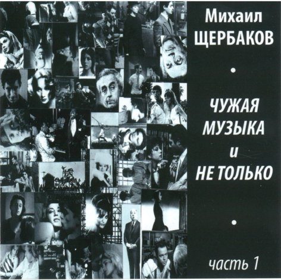

= Чужая музыка, часть 1
Михаил Щербаков
2010
:toc:

From::
http://blackalpinist.com/scherbakov/Disks/ +
https://mkshch.com/

== Почти

[verse,2006]
____
Почти четырнадцать, а мир всё не родной.
Всё та же оторопь. Должно быть, я агностик:
хочу, чтоб истина одна сияла предо мной,
но их то две, то ни одной, то сразу гроздь их.

Иду сегодня я в райком, не то в горком.
У них там истина всегда сияет ясно.
И, если я не объявлю, что с нею не знаком,
они железным наградят меня значком. Единогласно.

Мою фамилию включат они в учёт.
И раз уж я не объявлю, что я агностик,
то мне и грамоту вручат, и скажут: на-ка вот!
Теперь ты — тот, кому почёт. Повесь на гвоздик.

Я всё приму, значок надену — не сниму.
Навеки, детство, ты прошло-прошелестело!
Цыплёнок тоже хочет жить, забудь мешать ему.
К тому же, собственно, кому какое дело?

Большого моря малый плеск не исказит.
Такие точно же значки полшколы носит.
Никто на грамоту мою и ока не скосит.
Однако я повешу, пусть пока висит. Еды не просит.

Иду сегодня я в горком, иду пешком.
И через двор, и через парк, и через мостик.
Обвёрнут я воротником, задёрнут козырьком.
И сзади хлястик узелком. Как вроде хвостик. 
____

== Завтра, _вчера_, всегда

[verse,2007]
____
Без выходных в три смены – конец квартала, своя гордыня – 
гвалт за окном и грохот, сдают объект, строители страх проворны.
С десяток зим тому здесь была пустыня.
А нынче улица Красных Зорь.
Этажи, балконы, антенны. Средние волны.

Диктор сулит концерт по заявкам чьим-то, в двенадцать с чем-то.
Я не писал заявок, но слушать стану, жуя сухомятный полдник.
Искал разбавить, шарил в шкафах, но тщетно:
Остался лишь полусладкий вздор 
от гостей – вчера или ранее, кто их помнит.

Кто их поймёт, внезапных, зачем возникли, чего хотели?
Тратились, рылись в адресном – только бы снять ленивца с кушетки шаткой.
Дорогой мёрзли, вязли в снегу, хладели.
На предпоследний пешком ползли: 
отключён подъём, что-то там не в порядке с шахтой...

Вздор по чужим заявкам – а щёлкнуть жаль, уж одно к другому.
Не повезло с напитком, так пусть певицу зовут Изабеллой тоже.
Не всё чинить допросы себе, _драгому_.
Не век терзаться – зачем вчера, 
а равно и ранее, жил, мол, как жить негоже? 

Да, мельтешил, слонялся. Ломал хлеб-соль, не растя колосьев.
Незачем было жить, низачем и не жил, имел что лежало плохо.
Чужую воду брал из чужих колодцев.
И то не так чтобы очень брал – 
сторонясь размаха, успеха, переполоха.

Эх, _бирюзовые-золоты-колечики_, где вы, чьи вы?
В адресном не узнаешь. Не намекнут вино и певица, тёзки.
Погасли зря среди лебеды-крапивы
приметно-памятные когда-то 
цветные девичьи-птичьи глазки-слёзки...

Завтра, вчера, всегда – отключён комфорт, высоки ступени.
Выйдешь по что-нибудь, а наверх ползи потом без подъёмной клети.
Само собой грехи, так ещё колени – 
то те, то эти грозят сумой 
при оплате в должной валюте. Не те, так эти.
____

== Не надо было

[verse,2007]
____
Не надо было думать, что само 
растает наважденье к лету,
что призрак этот канет в Лету сам, 
без помощи властей.
Вот если бы, едва пришёл он к нам, 
его мы посадили в клетку –
тогда бы ни скандала, ни страстей...

А нынче впору в область почту слать: 
явился, мол, пришелец нервный,
которому не то что "руки вверх", 
но скажешь только "эй!" – 
и он уже шумит, как море. 
А море миру недруг верный.
И призрак тоже недруг, знать бы – чей.

Хотя бы знать – умён ли, глуп ли он, 
повадлив на какие плутни,
из тех ли он, бразды при ком не взрой 
и сотки не засей,
кто наши все початки прекратит, 
отменит черенки и клубни...
Вкушай потом объедки, латки шей...

Пытались проходимца лестью взять: 
мол, очень ты шумишь искусно.
Надеялись, размякнет недруг, но 
сказали только "эй!" –
и он уже молчит, как камень. 
А камню никогда не грустно,
ему заботы нет ни до кого...

Его пренебреженье таково.
Его предупрежденье грозово.
Не надо было думать, что само... 

А надо было белый, что ли, флаг 
пошить из лоскутов и латок,
послать уведомленье в область (пусть 
готовят толмачей),
одеться максимально скромно, 
остаться без щитов, не в латах,
забыть на время злость и доблесть –
и кинуться пришельцу в ноги...

Сказать ему, что самый острый меч 
повинной головы не рубит:
мол, если мы неправы – что ж, казни! 
Но лучше пожалей...
А он опять шумит, как море.
А море никого не любит.
А море не жалеет никого. 

Уже по той причине, что оно – море.
____

== Песнь о Неведенье

[verse,2007]
____
На тринадцатый день календарь стушевался и время повисло отвесно.
Жили в нём и не ведали мы – 
ни о том, сколько нам до отъезда, ни о том, доживём ли...

И когда от неведенья мне и тебе
почему-либо делалось не по себе –
до заката пустую покинув гостиницу, шли мы в деревню.
Словно снеди и вправду хотели простой
(что осталась ещё от недели Страстной).
То есть местной еды. Впрочем, столь же безрадостной, сколь и густой.

И природа цвела, и на пасеке ульи гудели, как струны в рояли.
А в воде, вдоль которой мы шли, 
неподвижные рыбы стояли, шевеля только ртами...

Но иною казалась еда, чем ждалась,
и над заводью заросль кололась и жглась,
и не пресной от берега веяло мелью, но далью и солью.
Намечалось начало всего, что затем.
И душа совпадала с немыслимо чем.
И мерещилось ей, будто небо рыдало над этим над всем.

Ничего-то оно не рыдало, скорей хохотало оно и глумилось,
да не вслух, не для нас, высоко. 
А Неведенье сладко дымилось – как река, то есть рядом. 

И, случись нам скатиться в Неведенье то,
чтобы там воплотиться немыслимо в что,
ничего-то с собою не взяли мы – кроме бы этих каникул,
чей напев был неладен и голос – хоть брось,
где не всё то цвело, что кололось и жглось,
где ничто не умело как следует сбыться. И вот – не сбылось...

Где и выжили мы бы едва ли, но где
неподвижные рыбы стояли в воде –
как во сне, обнимающем вечность, но длящемся меньше секунды;
где душа лишь себя не боялась одной –
и надменное небо смеялось над мной,
но грозой не лилось и глазам не являлось. Плыло стороной.
____

== Примечание к «Быстрову»

[verse,2009]
____
В апреле, да, но был этот весь сыр-бор не первого, а второго.
И прямо сидел кассир, и глядел в упор. Но он не узнал Быстрова.
Узнаешь тут – когда в потолок палят, пугают огнём и дымом,
и в пятнах на злоумышленнике бушлат, и шапка-ушанка дыбом.

С пальбой Быстров, положим, пересолил. Но – взял-таки куш, затейник.
И вышел цел, не вывели, полон сил и с полной ушанкой денег.
И лишь тогда, а вовсе не до того, не загодя, не вначале,
напали скорбь и оторопь на него. Но не на того напали.

Теперь он знал, что зло иногда не зло, а только такое слово.
Что сбросит он камуфляж, освежит чело – и мы не найдём Быстрова.
Что с космосом и с собою разлад уже его не гнетёт, не бесит:
вся тяжесть лишь в оболочке, а не в душе. Душа ничего не весит.

Не ясно, как в итоге взбрело ему, такому теперь иному,
свернуть, пусть не к реке, но некоему, действительно, водоёму.
Плохой свидетель лодочник-инвалид, под сорок уже в маразме.
Ни на одном наречии не говорит. По-португальски разве.

Насчёт лекарств и, якобы, пузырька дающих свободу гранул:
положим, был пузырёк, но без ярлыка, и тоже как в воду канул.
Пока спасибо сыщикам и на том, что (денно трудясь и нощно)
нашли тот самый, кажется, водоём. Или такой же точно.
____

== _Завтра_, вчера, всегда

[verse,2008]
____
Не умеешь ты, туземец, отдохнуть по-людски.
И по плану вроде всё – а некстати.
То и дело что-нибудь чему-нибудь вопреки,
а в результате – вдрызг и на куски.

Вчера, допустим:

и фамильную ты бронзу к рукавам приклепал,
и за вход предусмотрел сторублёвку,
а в троллейбусе сомлел, остановку проспал – 
и в Третьяковку снова не попал.

Не тебя вчера на целых полтора этажа
от глубин, где гардероб и буфет,
возвела в итоге мадемуазель Наташа.
Экскурсовод. Искусствовед.

Моргнёт – и звёзды гаснут...

Хорошо, на этот раз не чересчур оплошал,
к замминистра на ковёр не потянут.
Сам плоды себе внушил, сам вкусить помешал – 
и сам обманут, ибо предвкушал.

Ума палата!

В мелодраме с первых кадров знаешь, кто негодяй.
В детективе раньше всех шайку вяжешь.
Но вне кадра в чём подвох и от кого нагоняй – 
не предукажешь. Даже не гадай.

А коль скоро апперцепция в тебе не черства
и тоскует от бесчинств и кощунств,
то на самый крайний край в аптечке есть вещества.
Поел веществ – упал без чувств.

Шелестят секунды: пять, четыре, три, две, одна...
А куда и почему стрелка скачет – 
не твоей бы в то вникать голове. Но она – 
слезами плачет, хочет быть умна.

Семён Семёныч!

Вот и водит не тебя по этажам Натали,
а того же, например, замминистра...
И манжеты лишь постольку на тебе не в пыли,
поскольку быстро подняты с земли.

Без прогноза перспектива – ещё тот каламбур.
А с прогнозом – ещё тот анекдот.
Всё рифмуется по принципу "лямур и тужур":
подвоха нет, а рифма врёт.

Ты, как встанешь утром завтра с той ноги, что правей,
снова запонки свои, обе штуки,
едким щёлоком промой, да смотри не пролей:
уж ладно брюки – руки пожалей.

И ноги тоже.

Но в троллейбусе не думай, что вкусишь от плодов:
где блистала Натали – место пусто.
Завтра смена не её. Будь готов, будь суров!
Зато в искусство вникнешь – будь здоров.

Как сказал на выпускном одном балу тамада
(в прошлом тренер по борьбе айкидо):
можно стать и после аута бойцом хоть куда.
Конечно, да. Но лучше – до.

А то обидно очень.
____

== Интермедия 7

[verse,2008]
____
Гони сто сорок вёрст. Мигай, гуди, шуми.
Всё снег по сторонам, да хвоя.
Рельеф за кольцевой – жилой, но не живой.
Чернеют имена, да сплошь не прочтёшь.
Опять сейчас одно – куда, поди пойми – 
ушло. Не разглядел его я.
В таком, как этот край, меня поди поймай.
Не зря он с высоты похож на чертёж.

Не то Волоколамск мелькнул и миновал,
не то, наоборот, Таруса...
Сечёт наискосок черта строку и слог,
за что же с беглеца отчёт или штраф?
Меж тех, кто на земле с моё отзимовал,
чутья беглец не чужд и вкуса.
Но всех, от коих мчит, он вех не различит.
Лишь эти, за чертой, учтёт не читав.

– Прощай, – гласят они, – вина твоя мала,
но мы её тебе запомним.
Почти или уже – ты сам на чертеже
заметен не любым глазам по зиме.
Ты сам – минутный шум, невнятная молва,
зачёркнутый никем топоним.
Оно пока светло, ещё куда ни шло,
а ночью на земле – ты сам по себе...

Черта наискосок, строка напополам.
Скулит погоня, след теряя.
Уж час, как обогрев угас, не обогрев,
и мёрзну я, хотя одет мехово.
Нельзя не миновать. Прощай, Волоколамск,
вовек не разгляжу тебя я.
Смешно махать рукой на скорости такой,
и всё-таки машу. Да нет никого.
____

== Надо было

[verse,2007]
____
Десять первых лет – я в изумлении таращился на белый свет.
Впрочем, и потом – воспринимал происходящее с открытым ртом.
Даже и затем – ещё, разинув рот, нередко замирал я, нем,
чуть только возникало предо мной
иного пола существо и повергало в зной.

Раз в густом метро одно такое угодило мне зонтом в ребро.
Всякий тут бы взвыл – а я, напротив, приосанился и рот закрыл.
В загсе номер пять нам поручили подружиться и совместно спать.
Я лестницей бежал бы боковой – 
но там с букетами и в галстуках сиял конвой...

Десять первых лет мы утешались идеалами, которых нет.
Кризис рос, как флюс. Изъяны нечем было крыть, и назревал конфуз.
Вдруг узналась весть, что можно крыть материалами, которых есть,
и мы не постояли за ценой – 
и, где потрескалось, навесили ковёр стенной.

Цел он и сейчас. Его бахромчатые джунгли поражают глаз.
В джунглях виден лев, и на лице его голодном очевиден гнев.
Ясно, что не Босх. Но тоже душу веселит и тренирует мозг.
Недаром очень много вечеров с тех пор
я скоротал, в узор означенный вонзая взор.

Вечер гас и тлел. Гуляли мухи по ковру. А я сидел, смотрел.
Думал года два – пока не выдумал, что муха интересней льва.
Лев пред мухой прост: всего-то пафоса, что грива, аппетит и хвост.
А у неё и крылышки, и ножек шесть!
Она довольствуется крохами, которых есть...

Сыну в десять лет мы подарили барабан, а надо было – нет.
Мальчик – меломан. Повсюду ходит с барабаном и бьёт в барабан.
А когда не бьёт – то окунаешься в безмолвие, как муха в мёд.
И чудится тебе, что только рот закрой – 
и всё желаемое сбудется само. Нет? Ой.
____

== Тоже пародия

[verse,2006]
____
Чтоб я так жил! 
Письменность ни к чему, корифеи слога – сплошь самозванцы.
Шекспир – мираж. 
Пушкин – негр.
С пелёнок буквы вели меня – 
хотя и прямо, но мимо.
Мама, отучи ребенка плакать, ударяясь о дорогу,
а потом уже, конечно, покупай велосипед.
На именины, в сорок лет.

Во сне всю ночь 
видел деньги.
Протёр глаза. 
Глянул – нету.
Опять под музыку спал не ту.
Поосторожней. Не мальчик.
Мама, научи ребенка плавать или, что ли, не дышать
(когда не надо), а потом уже расстёгивай карман
и покупай катамаран.

В саду черешня, в роду родня.
Космос в придачу к метрике, от забора – и вон дотуда.
Того желали вы или как?
Вас, дорогие дети, никто не спросит ни до, ни позже.
Не любишь двигаться – не люби.
Ложись и думай. Не лягу!
Что бы я ни выдумал, чего бы ни надумал я, а денег 
не прибудет у меня определённо никогда.
А вот убудет – это да.

Всё зло от музыки, всё она!
Знал бы, что в ней отрава, давно оглох бы на оба уха.
Порой, задумавшись, подпоёшь – 
после сидишь неделю полощешь горло, обняв черешню.
На днях игрушечный взял пугач,
приставил к сердцу – и щёлкнул. 
Мама, ты как хочешь, а ребенка не научишь ты летать.
Бери последнее со счёта и как хочешь поступай.
Но самолёт не покупай.
____

== Завтра, вчера, _всегда_

[verse,2009]
____
В городе вчера пришла в движенье почва.
Ратуши и плац попятились, качнувшись.
Памятник осел, внушительность утратив.
Хрустнули пласты — но тут же всё затихло.

Трепета курьёз не вызвал в горожанах.
Молча над едой склонились кто попроще.
Умные руками развели и только.
Мудрые между собой переглянулись.

С год тому примерно было точно то же.
Может, и не точно то же, но примерно.
Молния задела дом неподалёку.
Впрочем, ничего, жильцы не пострадали.

Разве что один как будто помешался.
Тот, что не вполне здоровым слыл и прежде.
Глубже начал он впадать в оцепененье.
Чаще замирал и вскоре вовсе замер.

Комнату учло жилищное начальство.
Вещи увезла машина грузовая.
Скудно жил жилец, конторские всё книги.
Был он счетовод и на дом брал работу.

Мельком удивились, нехотя вчитавшись.
Думали — баланс, а это амфибрахий.
Быстро увязали, ловко погрузили.
Двигатель взревел — и тоже всё затихло.

Надо же, вчера какая вновь нелепость.
Жди опять ремонтников и следопытов.
Впору замыкать ворота на щеколду.
Cлишком что-то много стало совпадений.
____

== Конец 1-й части

[verse,2010]
____
От багажа избавившись и в зале ожиданья несколько остыв,
себя позавчерашнего сужу не без усмешки.
Отпала предыстория, на тысячу рассыпавшись частей.
Теперь убытки все (издержки спешки) – долой с костей.

Как оплошал в ломбарде я – пускай потом оценщик вам наврёт,
анкету опровергнет паспортистка, та ещё лиса...
Аэропорт «La Guardia» работает на вылет и на влёт.
Беспересадочный до Сан-Франциско – в четыре часа.

Ретироваться некуда. Уже в мировоззренье, в самое нутро,
внедрилась и хозяйствует весёлая бацилла.
Душа опять, как некогда, затребовала крыльев и колёс.
И острота прицела, даль посыла – почти всерьёз.

Хотя, конечно, в сущности, летание за тридевять столиц
(меж коих и Манхэттен – лишь заминка, выспаться и прочь) – 
не перемена участи, а так себе листание страниц.
И хорошо, что хоть одна картинка, да не точь-в-точь.

Уразумел дистанцию – и вот уже другого цвета этажи,
и вот уже трамвай не тот же, что в Москве на Божедомке.
Не те над морем уровни, и рельсы расположены не те – 
на рубеже стихий, по шву, по кромке, почти в нигде.

Но где, в укор Евразии, маршрут не озадачивает меня:
я верю, что вожатый трассу эту знает назубок.
А для какой оказии он влево поворачивает, звеня?
А для такой, что прямо рельсов нету, есть только вбок.

Оревуар, отечество! И вы, его дымы, и ты, родная речь,
и кашель ежеутренний, и огненная влага...
Теперь суровых лётчиков пример передо мной несокрушим.
У одного из них, у Джима, фляга. Но скряга Джим.

Во фляге ром «Бакарди», а? Но Джим скорее выльет, чем нальёт.
Зато и отправляться с ним без риска можно в небеса.
Аэропорт «La Guardia» работает на вылет и на влёт.
Беспересадочный до Сан-Франциско...

Четыре такта паузы, а дальше звуковая чудо-полоса –
до окончанья диска.
____

== Если

[verse,2001]
____
Если пойдёшь ты пешком через ручей к развилке, 
то укрепи гребешком волосы на затылке. 
Порох и дробь выбрось вон, страхи забудь лесные. 
Смело шагай, это сон. Хищники в нём не злые. 

Не подведёт тишина, сумерки не обманут. 
Глянет из тьмы хижина. Страхи назад отпрянут. 
Конный туда - ни за что. Дело другое - пеший. 
Это твоё, это то, где чудеса и леший. 

В колбе бурлит вещество. Леший бубнит заклятья. 
Нет у него ничего, кроме его занятья. 
Кровля над ним ветхая всхлипывает протяжно. 
Знаешь, он кто? Это я. Или не я, не важно. 

Важно, что не пропадёшь, даже не огорчишься, - 
если пешком ты пойдёшь, а не верхом помчишься. 
Наискосок, за овраг, через ручей и поле... 
А гребешок - это так, для красоты, не боле.
____

== Быстров

[verse,2001]
____
Неправда, что Быстров был крепок и суров.
Скорее хрупок был он и затылком нездоров.
Он мнил себя изгоем, но пойти на криминал
не смел, пока лекарств не принимал.

Враньё, что сей изгой, истерзанный тоской, 
решил-таки ограбить супермаркет на Тверской. 
Решить-то он решил, но не ограбил же, учтём. 
Эксперты разберутся - что почём. 

Неправда, что была пальба, и все дела. 
Пальба была потом и лишь Быстрова извела. 
Мечтателем он был и домечтался до беды. 
А может, начитался ерунды. 

Другой бы не моргал, а этот маргинал 
три дня топтался в центре, супермаркет выбирал. 
А выбравши, провёл дрожащей дланью по губе - 
и гибель стал готовить сам себе. 

Чтоб вышло без улик, в подвалы он проник, 
охрану сосчитал, сигнализацию постиг. 
Он даже куш прикинул, тоже фокусник, смешно! 
И понял, что не выйдет, не дано. 

Для виду наш факир, в корзину взяв кефир, 
к воротам развернулся, но узнал его кассир. 
За партой с ним сидел когда-то в классе он шестом. 
Пришлось потолковать о прожитом. 

Не гангстер, а беда! Судите, господа: 
ему б кассира в долю, кассу в сумку и айда. 
А он челом намокшим покивал: до встречи, мол. 
И медленно в Чертаново убрёл. 

Враньё, что скрылся он с деньгами за кордон. 
Он еле заказал себе билет на Лиссабон - 
и первого апреля вышел из дому с утра. 
А найден был четвёртого, вчера. 

Что были мы друзья - опять пример вранья. 
Иные даже врут, что он и был как будто я. 
Нерадостно, конечно, да людей не сокрушить. 
Мечтать предпочитают, а не жить. 

Его нашли в реке, с отверстием в виске
и русско-португальским разговорником в руке. 
Преступная улыбка на безжизненных устах 
внушала сожаленье, но не страх. 

О, сколько ложных мук! О, сколько сразу вдруг! 
Неправда всё, неправда всё, неправда всё вокруг... 
Тоской истерзан, я лекарство за щеку кладу 
и медленно в Чертаново бреду.
____

== Сверчки-кузнечики

[verse,2000]
____
То ли дело прежде! Крым, Кавказ...
Что ни похвали - твоё тотчас. 
Чином рядовой, лицом министр. 
Беден, да не жаден, глуп, да быстр...
    Нынче ж и умён, да звон другой.
    Сколько ни склоняйся над струной,
    может, и сведётся гамма к «до»,
    да не отзовётся знамо кто...

Где теперь увидишь нас вдвоём?
Разве что во сне, и то - в моём.
Что теперь ей Крым, Кавказ, Багдад?
Нынешний приют её богат - 
    долог в ширину, широк в длину...
    Там она, должно быть, как в плену,
    посреди гардин и хризантем 
    так и пропадает, знамо с кем...

Рассеку подкладку по стежку,
перстень обручальный извлеку.
Осмотрю его, вздохну над ним -
и зашью обратно швом двойным.
    Вы, сверчки-кузнечики в ночи!
    Всякий до утра своё кричи. 
    Пусть под вашу песню в три ручья 
    пленница заплачет, знамо чья...

И дают кузнечики концерт, 
и поют сверчки на весь райцентр,
и под эту песню в три ручья 
сам, однако, первый плачу я. 
    Плачу о безумствах давних дней,
    о себе тогдашнем и о ней, 
    о кольце, зашитом на два шва,
    и ещё о том, что жизнь прошла...

А наутро морщусь вкось и вкривь,
дымчатым стеклом глаза прикрыв.
Между тем как пленница горда -
вот уж кто не плачет никогда. 
    На окне решётка, дверь с замком,
    а она не плачет ни о ком.
    Ни к чему ей тёмные очки.
    Что же вы, кузнечики-сверчки?

Прежде-то, известно, чуть хандра -
не жалей вина до дна ведра. 
Нынче ж и бальзам ценой в брильянт,
еле пригубив, верну в сервант.
    Древний со стены кинжал возьму,
    паутину-пыль с него сниму.
    Лезвие протру и рукоять -
    и повешу на стену опять.
____

== Без названия

[verse,2001]
____
У меня был удачный день. Я проехал немало миль.
Я прослушал богатый набор песен радио-ретро.
Я забыл, что такое лень. Я забыл, что такое штиль.
И от ветра слетел мой убор - головной, что из фетра.

    Ждал учтивый меня приём. Вечеринка из мира грёз.
    Джо Димаджио в списке гостей. Или кто-то подобный.
    Ждали чаши с вином и льдом, чудо-клавишник виртуоз -
    и фуршет, без особых затей, но отменно съедобный.
    А ещё водопад новостей и хозяин предобрый.

Он представил меня родне. Я легко полюбил родню. 
Важный дядя мне руку сдавил (губернатор, не ниже). 
С двух сторон улыбнулись мне две племянницы-инженю. 
А вихрастый кузен заявил, что учился в Париже. 

    Грянул клавишник до-ре-ми, откусил от сигары край - 
    и во все свои сколько-то рук принялся за работу. 
    Мёдом ты его не корми, виски с содовой не давай, 
    разреши ты ему этот звук, эту самую ноту. 
    Чтобы всё замелькало вокруг, предаваясь полёту. 

Между танцами я успел и освоить второй этаж, 
и кузену допрос учинить: тяжело ли в ученье. 
Я бильярдную осмотрел, не шутя посетил гараж. 
И на кухню зашёл уточнить, как печётся печенье.
 
    Выбивался ли я из сил? Наряжал ли себя в чалму? 
    Подражал ли Димаджио Джо? Да ни в коем же разе! 
    Я общителен был и мил, ибо помнил, что час тому 
    прикатил в особняк на «пежо», а не в тундру на «КрАЗе». 
    Всё, что делал я, было свежо, как растение в вазе. 

Уходя, пожевал я льда. Пожелал доброй ночи всем. 
Двум племянницам я подарил две зелёные груши. 
И отправился в никуда. Но с три короба перед тем 
губернатору наговорил возмутительной чуши. 

    А снаружи мела зима. Но за нею пришла весна. 
    Следом лето пришло, а потом - сразу осень, конечно. 
    Предо мною - как в синема - скалы, заросли, племена 
    возникали своим чередом и скрывались неспешно, 
    то пылая бенгальским огнём, то чернея кромешно.
 
У меня был удачный день. Он не кончился до сих пор. 
До сих пор я и гость и жених - на балу и в пекарне. 
В небе, несколько набекрень, головной мой парит убор. 
И фасады окраин родных не мешают пока мне. 
А не то бы я камня от них не оставил на камне.
____

== Nemo

[verse,2002]
____
Пока я был никто, не обитал нигде,
примерно лет от двух до трёх,
я наслаждался тем, что никакой вражде
не захватить меня врасплох.

    Любой в ту пору шторм, иных сбивавший с ног,
    не досадил бы мне, заметь.
    И ни один гарпун тогда меня не мог
    (не говорю - пронзить) задеть.

Тогда любая власть, любой творя эдем,
не причиняла мне вреда.
Ведь я же был никто. И потому никем
не назывался я. О да.

Именовался я не вожаком вояк,
не завсегдатаем таверн.
Я тёзкой был тому, кого в подводный мрак
отправил странствовать Жюль Верн.

    Была недвижна зыбь, невысока волна.
    И мог ли думать я тогда,
    что мне ещё тонуть, не достигая дна,
    в стихии злейшей, чем вода.

Была надёжна ночь (пока я слыл ничем),
как дверь, закрытая на ключ.
И только лунный шар, как водолазный шлем,
незряче пялился из туч.

А предстояло мне не по лазури плыть
на зов луны, волны, струны,
но рыть болотный торф и чужеземцем слыть
на языке любой страны.

    Вдали от райских рощ, где дышат лавр и мирт,
    считать отечество тюрьмой
    и бормотать в сердцах «какой невкусный спирт»,
    лечась от холода зимой.

И повергаться ниц, теряя нюх и слух,
когда случится вдруг узреть,
как стая синих птиц клюёт зелёных мух
(лечась от голода, заметь).

Перебираться вскачь по разводным мостам,
спасаясь из огней в огни.
И перебраться прочь, и оказаться там,
где чужеземцы лишь одни.

    Где никакой за мной не уследит Кусто,
    где не видна блесна ничья.
    Я раньше был никем. Я и теперь никто.
    Но только знающий, кто я.

А далеко вдали, где в роще бьёт родник
и дышат мирт и лавр и клён,
уже пустился вплавь мой молодой двойник,
ещё не знающий, кто он.
____
