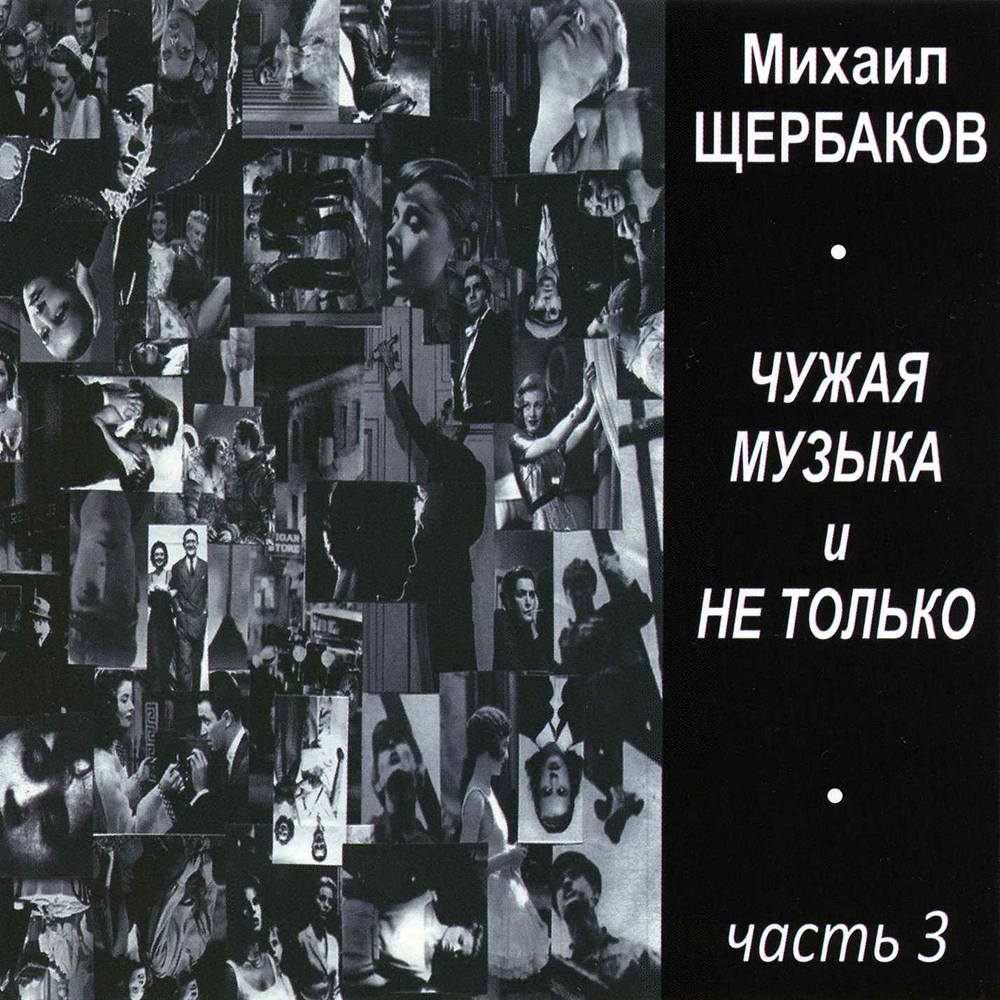

= Чужая музыка, часть 3
Михаил Щербаков
2015
:toc:

From::
http://blackalpinist.com/scherbakov/Disks/ +
https://mkshch.com/

== Смотри

[verse,2012]
____
Надеюсь, близорукость моя была отчасти полезна:
просеянные, соблазны реже захлёстывали, дразня.
Но чувствую, что с накипью заодно отсеялась бездна,
в которую не вгляделся я, глаза пожалел. А зря.

Не стоило их жалеть, на то и глаза: поплачут-помокнут –
и в самой пустой обыденности метафору уследят.
Хотя, коль скоро снова дойдёт до слёз, метафоры не помогут.
Скорей всего не помогут, но навряд ли и навредят.
Смотри, возник сквозняк, задышал камин. Зола золотиста.
Качнулся в круглой чашке красный морс, похожий на Марс.
И прямо с утра газетная злоба дня, мечта куплетиста,
разбита сама на строфы и читается как романс.

Куплет насчёт погоды пуще других затейлив и жуток:
в бюро прогнозов нынче новый барометр, грамотей.
С антенной он всемирной соединён, ему не до шуток.
Его послушав, хочешь не хочешь, падай и холодей.
Но я куплю фонарик «Светлячок», похожий на светоч,
и выйду в ночь, накинув зелёный плащ, похожий на плющ.
А ну как тот барометр в бюро не больно-то и всеведущ?
И весь его ледяной кошмар не очень-то и грядущ?

Смотри, скажу туземцу встречному я (ежели встречу),
не та ли, смотри, младая, вон там за облаком, где лучи?
Ей должное воздал легендарный грек певучею речью –
по памяти, ибо видеть уже не мог. А ты различи.
Слетевшая с воздушного своего безгрешного ложа,
не знающая об опасностях, свободная от клише –
тебе, дикарю, явиться она спешит, ни на что не похожа.
Её не догонишь ты, но хоть порадуешься в душе.
____

== Тир "Боярд"

[verse,2006]
____
Хорошо было Жан-Поль Сартру. _Existence_ изо всех фрамуг.
Чуть предлог, на засов мансарду — и твори без помех про мух.
А попробуй-ка без засовов под густой коммунальный лай,
за ночь вымокнув и засохнув, четверть текста наутро сдай.
Вынь-положь в «Обозренье» очерк о всемирных войсках ООН.
Вновь не взялся никто из прочих. А ты взялся, душа с них вон.
Фактов нет, подоткнёшь намёков, лыко в строку да шерсти клок.
Может, высохнув и намокнув, четверть суммы получишь в срок.

Впору плакать, а ты не плачешь, а ты песни поёшь без нот.
То ли гордость от прочих прячешь, то ли ровно наоборот.
А я знаю, о чём поёшь ты и куда ты потом пойдёшь.
Потому что на тех похож ты, кто на прочих не всех похож.
Не пойдёшь ты потом, я знаю, пить «пять звёздочек» под стерлядь.
А пойдёшь ты потом, я знаю, из ружья по китам стрелять.
Есть в Нескучном саду потешный, шестистендовый тир «Боярд».
Это промысел твой безгрешный, это твой клавикорд, Моцарт!

Только в тире по крайней мере так уместны ружье и ты,
плюс мишени — морские звери: чудо-скаты и чудо-киты.
То-то ты, подходя к «Боярду», машешь крыльями — будто сам
завтра тоже себе мансарду купишь с видом на Нотр-Дам.
На четыре косых сажени отступив от подводных чуд,
бьёшь ты в яблочко, а мишени словно ровно того и ждут.
Кит обильным кренится боком, толстым боком, такой смешной!
Скат чернильным сочится током. Лобстер делает всем клешнёй.

То-то чудо, когда в два счёта ты из ста выбиваешь сто!
А в «Боярде» как раз — суббота, супер-что-то и Бог весть что.
Ты стоишь, ковыряешь в носе, а кругом фейерверк зажгли — 
и несут тебе на подносе сто «косых» и билет в Орли.

Часом позже, в аэроплане, засыпаешь и смотришь сон,
как (с большим _porte-monnaie_ в кармане) принимаешь парад ООН.
Как вдоль танковых и пехотных войск идёшь ты, чеканя шаг.
Дескать, тот ещё сам охотник. Только спрятанный под пиджак.
... Рдеют цифры на мониторе: минус семьдесят за бортом.
И в окне голубое море покрывается снегом и льдом.                                                              
Стерлядь-чудо златым как уголь глазом блещет из полыньи.
Турбулентность идёт на убыль. Нотр-Дам говорит _bonne nuit_.
____

== Теперь и прежде

[verse,2011]
____
Кто сам головой не понял, тому сейчас объясню словами.
Теперь – это вам не раньше, где вы последний, а я за вами.
За вами теперь не я, а одно зиянье, ага, зияет.
И радо оно восполниться, да чем – само не знает.
А я по Стене Китайской уже хожу, не тужу, не маюсь.
Хвалю заповедник в отзывах. На фото, ага, снимаюсь.
Вокруг меня население – всё между собой похоже.
И ладно бы меж собой, но всё и на меня оно похоже тоже.

Прямо навеки какое-то братство,
родство и свойство, поголовный буддизм.
Меж толп и масс я ближним не стеснён,
поскольку аз есмь он.

Во всей вообще природе я отражаюсь, как в трельяже.
Гляжу с парохода в реку, ага, и вижу в реке меня же.
А судно готово плыть. Капитан: отдай, говорит, швартовы!
Отдам, говорю, но разве мы на «ты»? Ах, что вы, что вы...

Остерегайтесь, товарищ начальник,
в единственном к нам обращаться числе.
Из нас со мной составлен шар земной.
Был мир ничей, стал – мой.

Спокойного судну плаванья, ни качки ему, ни течи.
Упрёк не речному флоту, но целиком обиходной речи:
действительность обновляется, а пословиц надёжных нету.
Не легче ли нормативы пересмотреть, чем повторять всю эту

чушь? Дескать, знай свой ресурс, время вышло...
Где край, дескать, стой... Ещё та ерунда!
Иные наступили времена.
Им края нет и дна.

На что уже слабый пол – и тот меняется повсеместно.
Вчера молодая ведьма – нынче добрая мать семейства.
И наволочки теперь у неё как снег. И клёцки в супе.
Неужто же нам она была милей, пока летала в ступе?

Смейтесь, – твержу я юнцам и юницам, – 
но так, чтобы после не слепнуть от слёз.
Ты врёшь, ты врёшь! – хохочет молодёжь.
И слепнет сплошь. Ну что ж.

И раз уж оно всё так обстоит, как сказано, а не эдак,
то некогда делать выводы (в заключение, напоследок).
Пора сочинять, не глядя уже на мостик на капитанский,
словарь поговорок новых, с переводами на китайский.
И кстати о молодёжи – всё же надо бы с ней построже:
то хочется ей чего-то, то не хочется ей того же.
Ведёт она вас в альковы, ага, срывай, говорит, покровы!
А утром: здрасьте, разве мы на «ты»? Ах, что вы, что вы...

О трудный возраст! Ужель без меня ты
управишься с веком один на один?
Где ты всё сам – там максимум ничья.
Успех лишь там, где я.

А я уже сам в Париже, ага, сижу на Пляс де Воже.
И хочется мне чего-то, и не хочется мне его же.
Вокруг меня население шьётся, треплется и канает.
Как будто недавно вылупилось и щупальца разминает.
И радо бы обрести оно образец. Да в ком – само не знает.

Племя слепое! Протри окуляры:
он здесь, он везде, все рецепты при нём.
Он друг племён. Он доктор и судья.
И этот «он» есть я.
____

== Не скифы

[verse,2015]
____
Как предок наш раздражал когда-то в долине пашущих на волах – 
так те же мы чужаки «нон грата» меж ныне пляшущих на балах.

Не впору нам чехарда и жмурки, какие всюду сейчас в ходу.
Все наши па – поперёк мазурки. Сельджуки-турки у нас в роду.

С древнейших лет на полях и недрах соседей к миру склонял сельджук.
Но как нарочно всегда лишь недруг сновал вокруг, а никак не друг.

Жестоки были его набеги. Лишал он почвы, лишал воды,
стараясь наши к нулю навеки свести труды и стереть следы.

Казнил он зодчих, секреты знавших. Сады секирой суровой сёк.
Богов он глиняных рушил наших, в муку толок – и по новой пёк.

В изгнанье шли мы, не чуя брода, на круглом шаре ища угла.
И всюду нас стерегла невзгода, вода душила и почва жгла.

В песках и топи, в чаду и всхлипе, под хохот выпи – ха-ха! хэ-хэ! – 
кончались мы от свербящей сыпи на Миссисипи и Хуанхэ.

От града с неба, от яда в снеди, от пули встречной и боковой...
Но всякий раз не от страха смерти, а лишь от смерти как таковой.

И недруг росчерком зря весёлым чертил на описи принял-сдал.
Урон смотрелся весьма весомым, но с тем, искомым, не совпадал.

Проткнув асфальт или прутья клетки, на свет опять вызревал сельджук,
в любой толпе различим без метки: какие предки, таков и внук.

Сбивался счётчик со всех настроек, однако сызнова вёл отстрел –
чтоб долго после студент-историк, сверяя цифры, в архиве прел.

Беги, школяр, от бумажной скуки. Забудь науки, ступай в холмы –
где, к небесам воздевая руки, поют сельджуки свои псалмы.

Возможно, чем-то иным ты станешь, когда, на выстрел подкравшись к ним,
из них кого-то убьёшь и ранишь. Но ты не станешь из них одним.
____

== "Прощание с Петербургом"

[verse,2006]
____
Меж вод и плит, чей двадцать лет назад
пленил тебя разлёт победный, — 
сегодня твой не в счёт холодный взгляд:
ему что Летний сад, что Всадник Медный.
Здесь был ты юн и страстию сражён,
её восторг любому ведом.
Но тот счастлив, за кем она с ножом
не век потом крадётся следом.

Счастлив ночлег в полночном полудне,
в дому, что — да, таки — доходен.
Лицом к стене, на жёстком полотне,
зато один вполне. Зато свободен.
Пускай такой свободы ради вся
прошла весна твоя в неволе.
Но в белой тот рубашке родился,
кто, взяв своё, отдаст не вдвое.

Покуда нет досуга небесам,
досуг земной казнит и судит.
Закон для всех, но кто казнится сам —
авось по всем статьям судим не будет.
Кем слово «прав» и слово «невредим»
устранены из лексикона,
тот сам судья. Хотя — закон един.
Вольно ж тебе не знать закона.

Не делать вид вольно, что пьёшь не яд
и что сластишь его не мёдом,
покуда флот прогулочный в Кронштадт
за горсть монет везёт тебя по водам.
Знобит с утра. Волна в Неве седа.
Погода впрок отметки ставит.
Но чья была весна не весела,
того зима не вдруг раздавит. 
____

== Рецензия

[verse,2015]
____
Ещё я утром веки еле разнял, уже звонок: лети-выручай!
У них премьера, им позарез экспертный отклик, не подкачай.
Достойно встреть новейшую драму. И – чем положено – увенчай.

Легко сказать, а мне-то в пятницу крюк – куда-то в пригород, в ковыли: 
премьеру сдвинули вглубь и в глушь (как в той же «Чайке», видите ли),
к живой земле, на дно котловины. Поближе дна найти не могли.

Уж раз цейтнот – извольте по проводам. Где недослышу – переспрошу.
Не зря я кадровый рецензент, во всех анонсах так и пишу.
Диктуйте вкратце самую сущность. Авось, осмыслю и причешу.

Итак, зачин классический, крах семьи, висит наследство на волоске.
В семье два сына, именно два, не три, фиксируем на листке.
Считай, как в том же Ветхом Завете. Зато не как в «Коньке-Горбунке».

Меньшой близнец безгрешен, чуть ли не свят, его удел – принятие мук,
источник коих – брат-антипод, мастак интриги, чёрный паук.
Соткать конфликт – задача злодея. Святому якобы недосуг.

Отец у братьев несколько не в себе, ему мерещится, что он – мать.
А где обычная мать – о том решаем голову не ломать.
Готовься к штурму, кадровый зритель! Твоя задача – не понимать.

Ах, да! Ещё массовка в роли толпы. Её девиз – быка за рога.
Она рычит и, кроме зеркал, везде умеет видеть врага.
Но затихает вовремя, если подкинуть ей кусок пирога.

Интрига вскачь, без пауз, подкуп-шантаж, подлоги, чистый «Декамерон».
Полно троюродных в дележе, а хищник хочет весь миллион.
Меньшой-то вряд ли претендовал бы. Но – оклеветан и удалён.

Казнит паук соперников, шанс растёт, идёт за первым актом второй.
Но тут массовка в роли молвы – хотя за злыдня, в общем, горой – 
спроста в районной хвастает прессе: кто, дескать, в пьесе главный герой.

Само собой, скандал. Быка за рога, сундук на ключ, бумаги на стол.
Отец, который якобы мать, лишает благ виновника зол.
А тот следит в замочную прорезь. Он хлопнул дверью, но не ушёл.

Внезапно мать, она же отец, во мраке ловит шёпот, как бы призыв.
И в нём, конечно, младшего сына мёртвый голос вообразив,
она – босая, через болото – спешит на зов. Но тут перерыв.

Болото, кстати, тоже не примитив, аппаратура на высоте.
Любой пейзаж, а то и орнамент, при потребности в красоте,
проектор лазерный полихромный лучами чертит на пустоте.

Весь третий акт затем безумная мать бежит по кочкам и камышу.
Тут я спросил: что, так и писать? Да, так и пиши. Ну, так и пишу.
Такую принял, стало быть, чашу. Такую, значит, ношу ношу.

Спасибо, хоть в четвёртом апофеоз, балет и цирк на фоне могил.
Злодей командует торжеством в помин о тех, кого загубил.
По стилю – что-то в духе dell'arte. По ритму – где-то даже Эсхил.

Убийца – в бычьей маске, в рогатой каске – выступает с левой ноги.
Вокруг массовка  – хором и врозь, рыча и плача – ест пироги.
Слышны тамтамы вместо салюта. И хвойный посвист в роли тайги.

Поёт тайга, что грех быка за рога (скотина может всех забодать),
но что в пиру не жалко и втрое съесть, а после пусть голодать,
и что, конечно, вольному воля. Хотя, опять же – век не видать.

Финальный луч рисует синюю зыбь, волну без берега и ковчег.
От зыби пахнет нашатырём, свезённым загодя из аптек.
Паяцы пятятся за кулисы. Мерцанье меркнет, падает снег.

Отбой, бросаю трубку. Кофе остыл. Табачный уголь в гуще гашу.
Теперь, пока не выйду на связь, меня не тронь, а то укушу.
Отнёс я ношу, выцедил чашу. Увидел дно. Лежу, не дышу.

Прощай, пальба в субботу в тире «Боярд»! Не применю оружья, пока
новейшей драме не разъясню, что не весьма она глубока.
Но – станет глубже. Если не завтра, то послезавтра – наверняка.
____

== Павловск

[verse,2013]
____
И полдень, и вокзал, и справочная – всё уместно было, кроме нас.
И очередь, и редкий дождь, и колея на Оредеж и Павловск.
Все пассажиры арии свои и роли знали, кроме нас.
Как если некий бы выдумыватель в чужую музыку вкропал нас...

К слову приплёл, вклеил в коллаж – 
к буфетным кружевам и модному по радио избытку средних частот.
Дождь был уныл, день был не наш.
Но в целой жизни не было у нас важнее дня, чем тот.

Как если ни единой бы живой души вокруг, разучивали мы
подсказанные кем-то реплики среди гуденья и мельканья.
Глухие чьи-то сны, навязанные нам, озвучивали мы,
от робости не договаривая, из гордости не умолкая.

Чей-то владел нами расчёт.
Сегодня очевиднее, но не яснее нам он стал, чем тогда.
Робость прошла. Гордость пройдёт.
А реплики не делись никуда, и мы не делись никуда.

Вокзал разросся вширь, столетье обновилось, норма с неба пролилась.
Диспетчера седого с должности внучатый вытеснил наследник.
Всех пассажиров скорый подобрал и в Павловск вывез, кроме нас.
Всё в тех же недомолвках путаемся мы. И радио шумит на средних.

Тот же сквозь шум модный акын – 
отсутствием фантазии не сокрушён и гордо режет правду одну.
Правде цена – медный алтын:
живой душе пока не до того, а мёртвая уже в аду.
____

== Конспект

[verse,2015]
____
Тщетны были кровь и обида войн и оплеух.
Чем ты ни лечи индивида – он неисправим.
Никак, отродясь и довеку, не признает он вслух,
что враг человек человеку, а не побратим.

Вот он, имярек безымянный, мирный фарисей.
Врёт он, что отменно гуманный норов у него.
Ни в долг, ни по службе ему ты доверяться не смей.
Он волк. И клыки его люты, все до одного.

Клеит корпус он «кадиллаку», или «москвичу».
Греет на обед кулебяку, либо чебурек.
Открыт, безоружен, умерен, даже кроток, но – чу! – 
хитрит, лепеча, что не зверь он, ибо человек.

Счётом не учтёшь и речами выразишь не в тон – 
что там в человечьем ночами вертится уме.
О чём говорит Заратустра с ним, пока лежит он
ничком – и глаза его тускло светятся во тьме.

Рядом – рода женского особь, тише тишины.
Спрятан в золотистую россыпь ангельский овал.
Как шёлк её нежная кожа, радостны её сны.
Но волк и она, она тоже, а не идеал.

О, жмых! Глинозём, обыватель... вечный середняк.
Ложных аксиом обожатель, здравых оппонент.
Лассо имяреку на ворот или наградной знак,
а всё печенег он и ворог, даже если нет.

Битва за сарай и колодец кончилась врасплох.
«Три – два!» – объявил полководец, – «живо по домам!»
И полк – ноги в руки и к дому, любо, братцы, эх! ох!..
Но волк рядовой рядовому, как и атаман.

Схему мы наметили с вами, юные друзья.
Тему доработайте сами до наоборот.
И, сняв оговор с имярека, укажите – в чём я
неправ. А теперь дискотека. Новый всё же год.
____

== Конец 3-й части

[verse,2013]
____
Уж если – хотя бы в округе, хотя бы местами – не мёртвое поле,
не пустошь, но всё-таки гряды, и даже сады кое-где,
негоже намёки и знаки в крамоле читать иноземной, 
ловить в чародейском кристалле и тёмной воде.

Сначала собрать надлежит урожай с гряд и веток в тяжёлые вёдра.
Всю зиму затем эту снедь поедать и хвалить, что вкусна.
И только потом – не быстро, не бодро, 
должно быть, вернётся весна.

В суровых провинциях люди живут, понимая – в чём толк и основа,
фамильной держась десятины и пользуясь днём световым.
Искатель, искать отучайся прямого ты с ними сближенья: 
оно не сулит продолженья конспектам твоим.

Забудешь, чего удостоят и что недоскажут суровые люди.
Лишь песню запомнишь, какую они запоют, осмелев:
Нам холодно здесь. Земля нас не любит – 
и тут же мажорный припев.

В сочельник большое семейство уляжется поздно, отпраздновав пышно.
Всё в доме погаснет и смолкнет. Но старшая дочь не заснёт.
Проплачет она – безутешно, неслышно – почти до восхода. 
И – тоже неслышно – под утро уйдёт на восход.

Дорогой, где редко, но всё же бывают повозки, бывают обозы,
а летом однажды мелькнул и растаял шатёр шапито...
«Куда ты идёшь? О ком эти слёзы?» – 
вдогонку не спросит никто.

Предвидеть, что станется дальше, умею не лучше, чем всякий и прочий.
Воздаст ли судьба золотыми – из тех, что пока в тайниках?
Возможно. Но тоже не быстро. Не проще, чем нынче и раньше. 
И тоже в черёд и с оглядкой, а больше никак.

Сперва до холмов мелколесьем, да там за холмами – опять мелколесьем,
в обозном ознобе, с бедой на душе, без гроша за душой.
И только потом – повеет предместьем.
И город начнётся чужой. 
____

== Жизнь прекрасна

[verse,2001]
____
Достиг вершин членкор какой-нибудь, главный врач,
большой знаток коленной чашечки.
Дрожит медчасть, когда он в белом весь шествует
лечить болезнь. Прошу к столу!

Глаза сверкают. В руках ланцет блестит.
Больной, молчать! Бояться нечего. Восемь, девять, аут.

Презрел покой какой-нибудь Давид Ливингстон. 
Легко ему с его винчестером. 
На Новый год махнёт в Центральную Африку. 
Одних слонов забьёт сто штук. 

Да львов штук двести. Да триста страусов. 
И будет жить в народной памяти - прям, плечист, высок. 

Но выше всех - гимнаст под куполом, это да. 
Не взять его за доллар с четвертью. 
Стальным узлом привязан к лонже он, молодец. 
Шпрехшталмейстер гордится им. 

А лонжа рвётся. Застыньте, граждане. 
Разиньте рты, прикиньте: падает... Ах, как низко пал. 

Прекрасна жизнь! Затейлив хруст её шестерён. 
Прищур востёр. Полки внушительны. 
Во фрунт равняйсь! Поблажек никаких никому. 
Чем гуще шквал, тем слаще штурм. 

Но гаснет вечер. И на штурмующих, 
как снег судеб, нисходит белая ночь. Отбой, гудбай.
____

== Лондон

[verse,2002]
____
Думал я, что Лондон сер, как слон.
Думал, что печален он, как стон.
А он светел, разноцветен он. 

Идучи по мосту Вестминстер, 
слышу нежный голос высших сфер: 
вот, мол, мистер, мост Вестминстер, сэр. 
Где хочу гуляю, счастлив, пьян. 
В центре у фонтана ем каштан. 
Всюду флаги. Джин во фляге прян. 

А вокруг, забыв зачем живут, 
лондонцы безрадостно снуют. 
Им всё мрачно, всё невзрачно тут. 
В Гамбург им теперь бы или в Рим. 
Здешний шум противен им и дым. 
Лондон пёстрый как нож острый им. 

Скуден быт британца, труден хлеб. 
Утром он садится, глух и слеп, 
в чёрный, тесный, шестиместный кэб. 
Каждый день он видит Риджент-стрит. 
Курит с кем попало и острит. 
Безупречно вымыт, вечно брит. 
Каждый вечер он, хоть хвор, хоть слаб, 
гордо входит, что твой маршал в штаб, 
в тусклый, скучный, равнодушный паб. 

Жаль британцев, худо им вполне. 
В Лондоне они как на Луне. 
Всё им тошно здесь, не то что мне. 
Немцев жаль, голландцев, римлян жаль. 
Круглый год в душе у них февраль. 
Дышат грузно, смотрят грустно вдаль. 
Вот бы, мол, пойдя Бог весть куда, 
встретить город, где бы жить всегда... 
А он — вот он, ест и пьёт он, да.

Слёз не льёт он, флаги шьёт он, да.
____

== Интермедия 5

[verse,2002]
____
Не в архиве при лампаде, не на Мойке в Петрограде, не в роще у ручья, -
на московской Маросейке поместился на скамейке я.
В книгу взором я упёрся. Что читал - не помню - Бёрнса? Хармса? - не помню что.
Но легко, без проволочек, одолел примерно строчек сто.

Не мечтая о скандале, принялся читать я дале.
Но - еле принялся - села на скамейку дама, из одних суставов прямо вся.
Только что в ларьке, где было дёшево, она купила отечественных кур.
Два кота, что рядом спали, встрепенулись и сказали «мур».

«Надо же! - вздохнула дама, - это же кошмар и драма: семь сорок за кило!»
...А вокруг Москва гудела, солнце жгло, к июлю дело шло...
«Жулики! - взметнулась дама. - Не товар, одна реклама, не куры - смех и грех.
Нет от этого товара ни бульона, ни навара, эх.

Чтоб у них труба сломалась! Жулики! - не унималась дама, - побей их Бог!
Мясо где? Сплошные кости. А у нас во вторник гости, ох.
Ни за что, - взревела дама, - не приму такого срама, лучше обратно сдам!»
...И пошла сдавать обратно купленный почти бесплатно хлам.

Шевелиться не имея повода, сидел себе я, обликом не светлел.
А кругом, гудя и воя, город каменный от зноя млел.
Кашлял он и задыхался. Я же вновь уткнулся в Хармса, не молвил ничего.
Небо наземь не спустилось, но в душе моей сгустилось некоторое хамство.
____

== Тема полёта

[verse,2002]
____
Ни даже в самом тайном подполье,
ни на приволье, ни во дворце -
не знать нам, дева, вечной отрады.
Нет нам пощады. Пропасть в конце.

Зря мы так важно в искрах и дыме
правим гнедыми сразу шестью.
Вечен лишь ветер над пепелищем.
Счастье отыщем только в раю.

Но оглянуться не удаётся.
Дева смеётся. Длится полёт.
Свита с шампанским следом гарцует,
танцы танцует, песни поёт.

Что, дева, делать? Конечно, смейся.
Со свитой слейся, танцуй да пой.
Завтра пусть пропасть. Пусть ночь, пусть немощь.
Всё пыль, всё мелочь рядом с тобой.
____

== Москва — Сухуми

[verse,2001]
____
Москва - Сухуми. За полцены билет.
Я еду к морю. Мне девятнадцать лет.
А за окном мелькает жизнь моя.
Но молод я. И не смотрю ей вслед.

Земля уставлена помпезными колоссами.
Гербы красуются едва ли не на всех воротах.
Локомотив гремит железными колёсами.
И рельсы не кончаются. И шпалы на местах.

Навстречу с юга, крича «пора! пора!»,
летят составы с утра и до утра.
Туда, туда, где холод и простуда.
Туда, откуда я укатил вчера.

А нынче ждут меня лимоны с абрикосами,
прибой неслыханный и новый горизонт вдалеке.
Локомотив гремит железными колёсами.
Как будто говорит со мной на новом языке.

Я еду к морю. В окно видна луна.
На верхней полке лежу, не зная сна.
А между тем проходит жизнь моя.
Но жизнь моя - кому важна она?

С лотков на станциях торгуют папиросами.
Таблички с буквами над кассами висят: перерыв.
Локомотив гремит железными колёсами.
Железными колёсами гремит локомотив.

В плацкартном людно. Опустошён буфет.
Все едут к морю. Не только я, о нет.
Все как один, в десятый раз иные.
А я впервые. Мне девятнадцать лет.

Вагон потрёпанный. Лежанки с перекосами.
Днём кое-как ещё, а ночью - ни воды, ни огня.
Локомотив гремит железными колёсами.
И море надвигается из мрака на меня.
____

== Белый берег

[verse,2002]
____
Был берег бел как снег. Не зря из века в век
белил его и чистил альпийских вод разбег.
На то, как берег бел, со склона сад смотрел.
В саду был дом, а в доме, дымясь, камин горел.

Дверной скрипел навес. И сад шумел, как лес,
пока закат струился - с вершин, с высот, с небес.
По склону мгла текла. И ты туда, где мгла,
холодными руками с собой меня влекла.

Потом опять высок и ясен был восток.
Опять прилив был звонок, опять певуч песок.
И все цветы земли, глаза раскрыв, цвели.
И Франция сияла за озером вдали.

Но стоны птичьих стай и вздохи волн меж свай
звучали так, как будто внушали мне: «Прощай!»
И берег, бел как мел, «прощай, прощай!» мне пел.
И ветер выл о том же, и тёмный сад шумел.

...Пришлось очнуться мне и прочь отплыть в челне.
Я плыл и жизнь другую задумывал вчерне.
Свежо дышал зенит. И дочиста отмыт
был берег тот, где ныне я начисто забыт.

И где огонь в камине моргает и дымит.
И сад шумит, шумит.
____

== Серенада

[verse,2000]
____
Горный озон прохладной тучей
гонит с закатом жар дневной.
Вот ведь какой досадный случай.
Прямо не знаю, что со мной.
     Либо Всевышний даст мне силу
     суетный прочь отринуть прах,
     либо сведёт меня в могилу
     та, на балконе, в кружевах...

Пусть не поймут меня неверно,
я ни секунды не влюблён.
Да, красота её безмерна,
локон волнист, лукав наклон.
     Веер сложив, она с ладони
     белого кормит грызуна...
     Нет! я чужой на том балконе.
     Ах! мне не нравится она.

Чуть бы пораньше, лет так на шесть
или хотя бы на пять лет, -
мне б нипочём восторг и тяжесть
этой любви. А нынче нет.
     Ночь не молчит, урчит, бормочет,
     много сулит того-сего.
     Но ничего душа не хочет
     там, где не может ничего.

Вздор эти все плащи и шпаги,
лошади вскачь, враги в расход...
Славной стезе зачем зигзаги?
Зорким очам - не до красот.
     Слушая, как нестройным эхом
     звон серенад летит во тьму,
     белый грызун дрожит всем мехом.
     Я не сочувствую ему.

Демоны страсти вероломной,
цельтесь, пожалуй, поточней.
Пусто в душе моей огромной,
пасмурно в ней, просторно в ней.
     Север зовёт её в скитанья,
     к снежной зиме, к сырой весне...
     Спи без меня, страна Испания!
     Будем считать, что я здесь не
     был.
____

